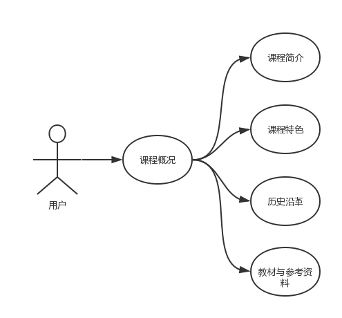
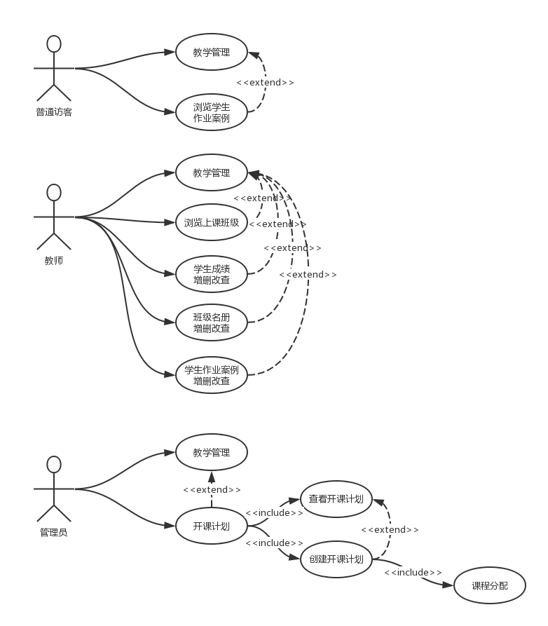

# UML课程设计(前端)
[项目需求文档](docs/)

## 目录 
 - [网站首页(贤政)](#网站首页)  
 - [课程概况(和泽)](#课程概况)  
 - [教师队伍(方勇)](#教师队伍)
 - [教学安排(乐祺, 文滔)](#教学安排)  
 - [教学研究改革(洪铭)](#教学研究改革)  
 - [教学资源(一起做)](#教学资源)  
 - [教学管理(俊熙)](#教学管理)  
 - [教学效果(庭辉)](#教学效果)  
 - [教学互动(锦坚)](#教学互动)  
 - [登录及权限管理(公正)](#登录及权限管理)
 - [项目规范及各种教程](#项目规范及各种教程)

## 网站首页  
### 功能描述
包括以下子功能：课程负责人，课程简介，课程特色，课程动态，教师团队（滚动展示），教学资源链接，友情链接。登录。

### 用例图
  

## 课程概况
### 功能描述
包括以下子功能：课程简介，课程特色，教材与参考资料，历史沿革。
### 用例图

## 教师队伍
### 功能描述
包括以下子功能：课程负责人，课程教学团队，主讲教师，青年教师培养。
### 用例图
> 将自己画好的用例图粘贴在这里  

## 教学安排
### 功能描述
包括以下子功能：教学大纲，教学日历，教学内容，授课计划，教学难重点，教学方法与手段。
### 用例图
> 将自己画好的用例图粘贴在这里  

## 教学研究改革
### 功能描述
包括以下子功能：教学改革措施，教学改革立项，教学改革成果，教学表彰和奖励。
### 用例图

## 教学资源
### 功能描述
包括以下子功能：课程课件（可以观看PPT、PDF、WORD），教学录像（可以播放视频），习题库（单选题、多选题、是非题、填空题、简答题、简单分析题、系统分析题、计算机水平考试题集），案例库（实验环境，实验系统代码，实验安装操作手册），实验任务，技术文档范本。
### 用例图
> 将自己画好的用例图粘贴在这里  

## 教学管理
### 功能描述
包括以下子功能：开课计划，上课班级，班级花名册，班级成绩单，学生作业案例。
### 用例图

## 教学效果
### 功能描述
包括以下子功能：校外专家评价，校内督导评价，教师自我评价，校内学生评价，社会评价，教学评估及相关文件。
### 用例图
> 将自己画好的用例图粘贴在这里  

## 教学互动
### 功能描述
包括以下子功能：微信群，QQ群，网站内的师生互动。
### 用例图
> 将自己画好的用例图粘贴在这里  

## 登录及权限管理
### 功能描述
### 用例图
> 将自己画好的用例图粘贴在这里  

## 项目规范及各种教程
### 约定
 -  所有路径全部使用绝对路径,勿使用相对路径,以免造成跳转错误.  
 -  命名要规范 (驼峰)  
### git
 -  [Git教程- 廖雪峰的官方网站](https://www.liaoxuefeng.com/wiki/0013739516305929606dd18361248578c67b8067c8c017b000)  
 -  [GitHub团队项目合作流程](https://www.cnblogs.com/schaepher/p/4933873.html)

### processon
 - [processon在线画用例图](https://www.processon.com)