**《软件需求分析与设计》课程综合实践**

**一、项目实训目的**

通过正向工程方式，完成用户提出的《面向对象分析与设计(UML)》在线开放课程平台的分析、设计、实现等环节。

按照Rational Unified
Process（RUP，Rational统一过程）的软件开发生命周期模型，指导整个项目的开发。分四个循环Cycles，每个循环实践四个阶段Phases，每个阶段实践九个工作流Core
Workflows。

通过四个Cycle完成四个版本。版本1.0各组独立完成，实现全部界面。版本2.0和3.0各组分工完成不同的功能模块。版本4.0各组集成在一起，完成整个系统的组装。从而实现敏捷软件开发。

**二、技术要求**

1、基于Java/JavaScritp语言和JSP技术。JDK虚拟机，MySQL数据库，Web服务器Tomcat，数据库服务器Apache。

建议：使用纯绿色软件JspStudy。JspStudy集成了JDK+Tomcat+
Apache+MySQL，JSP环境配置一键启动。无需修改任何配置即可迅速搭建支持JSP的服务器运行环境。

2、Win2000/XP/win7/win8/win2008 操作系统。

3、IE浏览器，Google Chrome浏览器，360浏览器等主流浏览器。

4、网络版的在线开放课程平台。从全省其他高校可以成功访问本平台，并进行相应的操作。

**三、功能要求**

客户端（前台）：

1、网站首页。包括以下子功能：课程负责人，课程简介，课程特色，课程动态，教师团队（滚动展示），教学资源链接，友情链接。登录。

2、课程概况。包括以下子功能：课程简介，课程特色，教材与参考资料，历史沿革。

3、教师队伍。包括以下子功能：课程负责人，课程教学团队，主讲教师，青年教师培养。

4、教学安排。包括以下子功能：教学大纲，教学日历，教学内容，授课计划，教学难重点，教学方法与手段。

5、教学研究改革。包括以下子功能：教学改革措施，教学改革立项，教学改革成果，教学表彰和奖励。

6、教学资源。包括以下子功能：课程课件（可以观看PPT、PDF、WORD），教学录像（可以播放视频），习题库（单选题、多选题、是非题、填空题、简答题、简单分析题、系统分析题、计算机水平考试题集），案例库（实验环境，实验系统代码，实验安装操作手册），实验任务，技术文档范本。

7、教学管理。包括以下子功能：开课计划，上课班级，班级花名册，班级成绩单，学生作业案例。

8、教学效果。包括以下子功能：校外专家评价，校内督导评价，教师自我评价，校内学生评价，社会评价，教学评估及相关文件。

9、教学互动。包括以下子功能：微信群，QQ群，网站内的师生互动。

管理端（后台）：

1、前台全部页面的内容维护。

超级管理员，二级管理员，在前台登录，切换到一个新的后台系统管理界面。

超级管理员，二级管理员，可以管理前台全部页面的内容维护。举例来说，在后台更新了"课程简介"的内容，则前台会自动显示出更新后的内容。在后台上传了图片后，在前台也会在正确的位置上显示新的图片。

2、账号维护。

超级管理员，可以创建二级管理员账号。二级管理员，除了不能创建新帐号（二级管理员和教师）外，其他可以操作的功能，同超级管理员。超级管理员，可以增删查二级管理员账号。可以重置二级管理员登录密码。

超级管理员，可以为某个教师创建登录帐号和密码。保证该教师可以为自己的班级输入学生名单、成绩和作业案例。超级管理员，可以增删查教师账号。可以重置教师登录密码。

超级管理员，二级管理员，教师，可以修改自己的登录密码。

3、制订开课计划。

超级管理员，二级管理员，可以创建开课计划。为即将上课的课程分配教师和班级（行政自然班）。

4、教师班级管理。

教师，在前台登录，切换到一个新的后台系统管理界面。

成功进入系统后，可以修改自己的登录密码，可以录入自己负责班级的学生名单、成绩和作业案例。

可以手动录入和自动导入学生名单和成绩，可以上传学生作业案例。

**四、领域实体**

1、参与者：普通访客，教师，二级管理员，超级管理员。

2、账号信息：账号，密码，类别，电子邮箱，手机。

类别分：教师，二级管理员，超级管理员。

3、教师信息：账号，密码，教师姓名，性别，出生日期，职称，邮箱，手机号码。

4、班级信息：班级编号，班级名称，年级，专业，班号。

5、学生信息：学号，学生姓名，性别，出生日期，籍贯，邮箱，手机号码。

6、学生成绩信息：学年度，课程编号，课程名称，班级编号，班级名称，教师姓名，学号，学生姓名，平时成绩，期中考试成绩，期末考试成绩，大作业成绩，总评成绩。

7、课程信息：课程编号，课程名称，学分，学时数。

8、课程负责人信息：姓名，性别，出生年月，最高学历，学位，专业，职称，职务，电话，Email，所在院系，通信地址，研究方向，简历。

9、教师队伍团队信息：姓名，性别，出生年月，职称，专业，学位，在教学中承担的工作。

10、教学内容信息：标题，发表时间，内容介绍。

备注：其他很多信息，都是这种表结构。使用相同的方式，显示在各自的页面上。

11、教学改革立项信息：标题，发表时间，下载地址。

备注：其他很多信息，都是这种表结构。使用相同的方式，显示在各自的页面上。

**五、业务流程**

前台页面操作流程：

1、普通页面。

1.1、访客打开任何一个普通页面。

1.2、可以观看页面中的内容。如果内容很多，可以分页显示，或者，右边滚动条拉动显示。

1.3、点击超链接，可以进入到下一个页面。

1.4、点击视频链接，可以调出视频播放器，播放视频。

后台页面操作流程：

1、教师登录。

1.1、教师用自己的账号和密码登录。如果密码忘记，可以通过"邮件"方式，找回密码。新密码由超级管理员设置。

1.2、教师可以看到本学期自己正在上的课程。

1.3、教师可以选择正在上的课程的班级，录入该班级的学生名单（手动录入，自动导入）。

1.4、教师可以选择正在上的课程的班级，录入该班级的学生成绩（手动录入，自动导入）。

1.5、教师可以选择正在上的课程的班级，上传该班级的学生作业案例。

2、超级管理员、二级管理员登录。

2.1、超级管理员、二级管理员，用自己的账号和密码登录。如果密码忘记，可以通过"邮件"方式，找回密码。新密码由超级管理员设置。

2.2、可以在左侧功能导航树上，看到自己可以操作的功能模块。点击某个功能模块，可以输入相关信息。确认无误，保存后，在前台页面上能够正确地动态反映出来。

2.3、根据需要，超级管理员可以创建二级管理员账号和教师账号。

2.4、根据需要，超级管理员、二级管理员，可以创建开课计划。为即将上课的课程分配教师和班级（行政自然班）。分配教师指：输入教师的登录账号和教师本人姓名。分配班级指：输入班级的编号和班级名称。

2.5、根据需要，对于离职的二级管理员和教师，超级管理员通过重置密码而不告诉二级管理员和教师的方式，使得他们成为非法用户。

**六、约束条件**

1、窗体内容显示风格1。文字、图片、表格、框架、超链接。

{width="5.768055555555556in"
height="3.243195538057743in"}

2、窗体内容显示风格2。文档下载，文档上传。

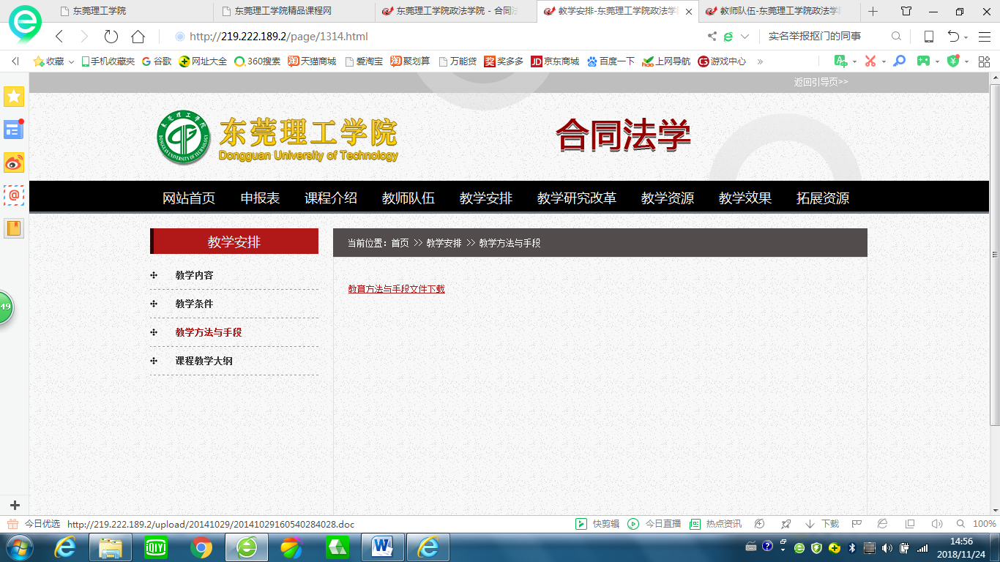{width="5.768055555555556in"
height="3.243195538057743in"}

3、窗体内容显示风格3。视频播放，PPT播放。

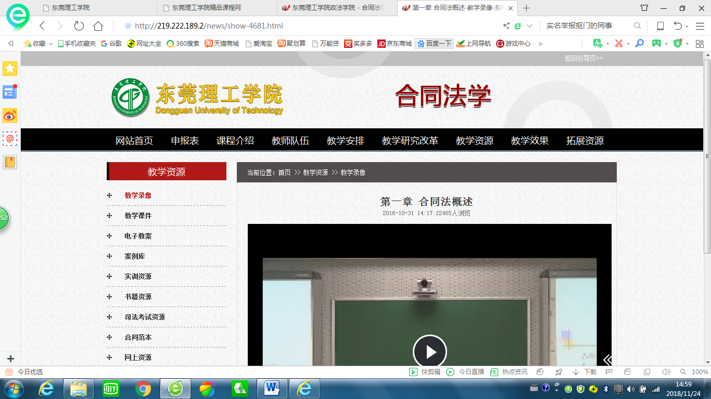{width="5.768055555555556in"
height="3.243195538057743in"}

4、窗体内容显示风格4。交流互动。邮件联系，在线QQ互动，在线微信互动，自编界面的互动。

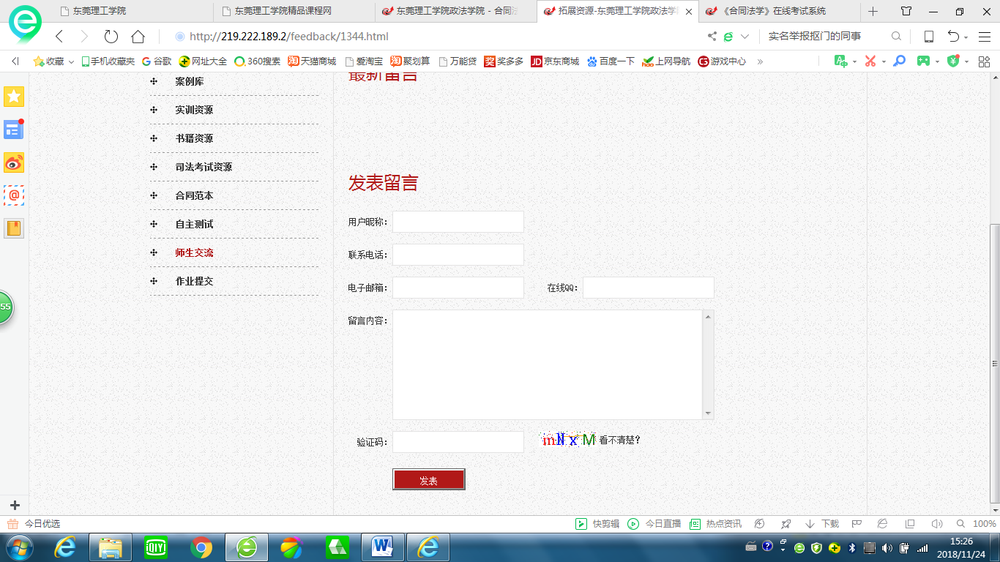{width="5.768055555555556in"
height="3.243195538057743in"}

5、超级管理员权限，二级管理员权限，教师权限，访客权限。

系统初始化后，生成两个超级管理员账号。

超级管理员，只能修改自己的登录密码，不能删除其他的超级管理员。

超级管理员，可以修改二级管理员和教师的各自登录密码，可以删除二级管理员和教师。

二级管理员，只能修改自己的登录密码，不能删除其他的二级管理员账号和教师账号。

教师，只能修改自己的登录密码。

访客，不需要账号。在前台可以访问任何页面。

**七、参考网站**

1、东莞理工学院精品课程网址http://jpkc.dgut.edu.cn/

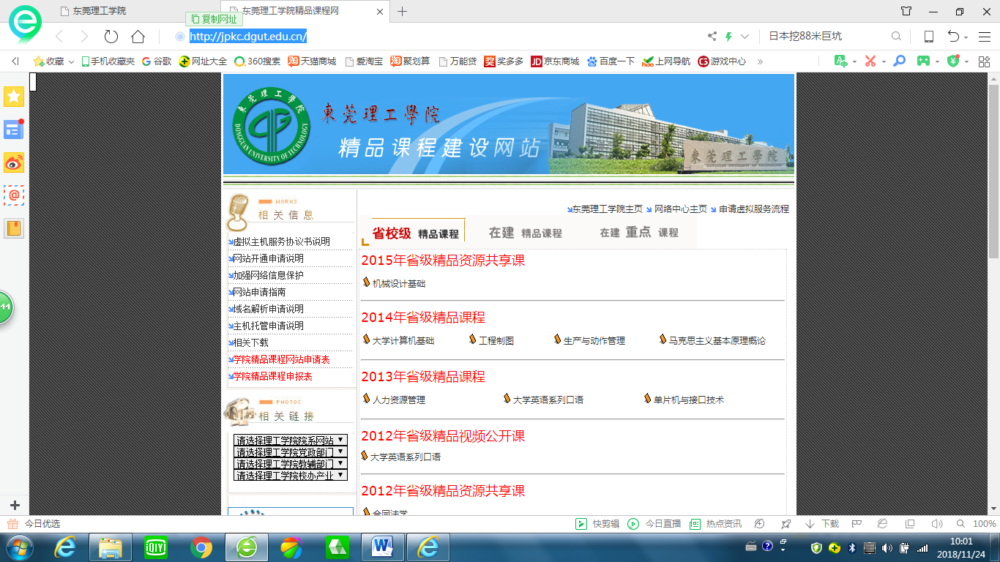{width="5.768055555555556in"
height="3.243195538057743in"}

选择其中的"2012年省级精品资源共享课《合同法学》"链接。

《合同法学》课程的首页http://219.222.189.2/

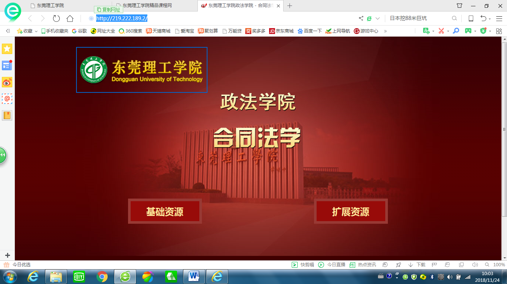{width="5.768055555555556in"
height="3.243195538057743in"}

《合同法学》课程的"基础资源"页面http://219.222.189.2/index.html

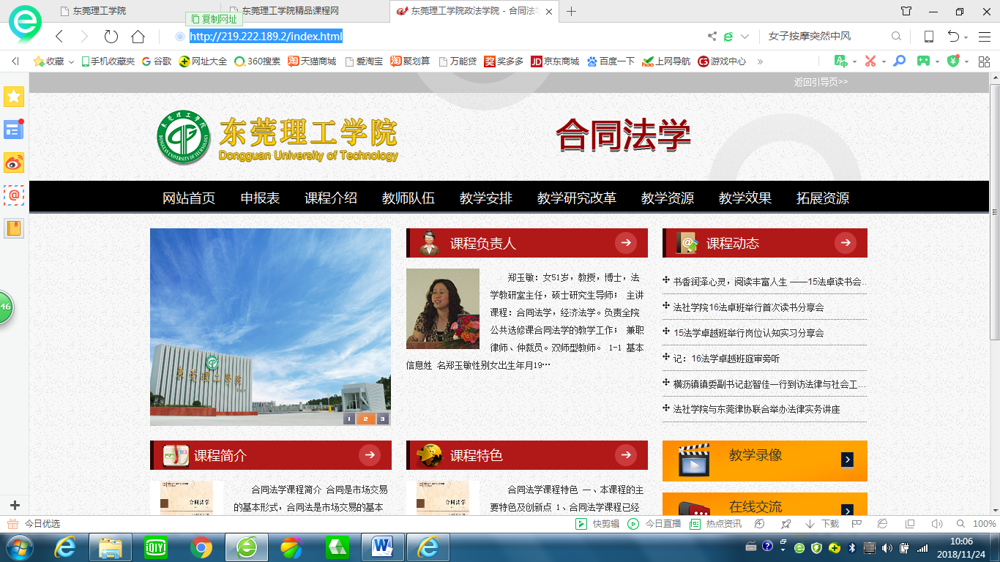{width="5.768055555555556in"
height="3.243195538057743in"}

2、厦门大学数据库实验室网址https://dblab.xmu.edu.cn/

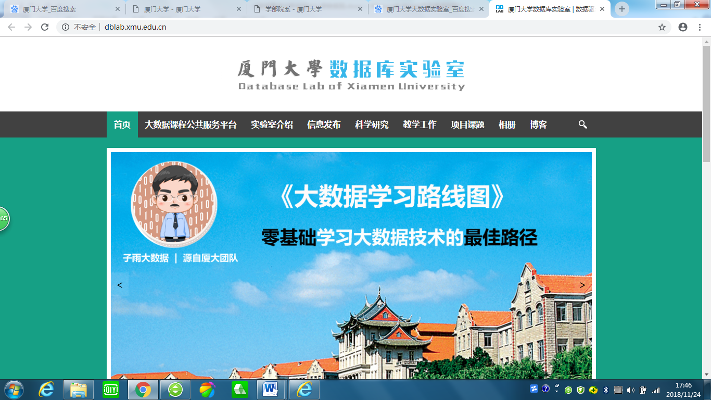{width="5.768055555555556in"
height="3.243195538057743in"}

高校大数据课程公共服务平台网址http://dblab.xmu.edu.cn/post/bigdata-teaching-platform/

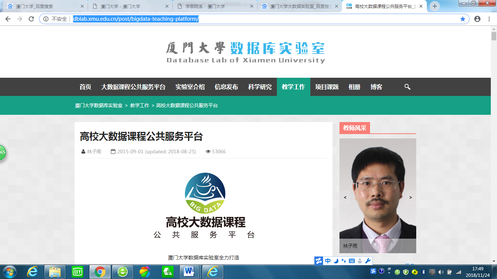{width="5.768055555555556in"
height="3.243195538057743in"}

大数据课程学生服务站网址http://dblab.xmu.edu.cn/post/4331/

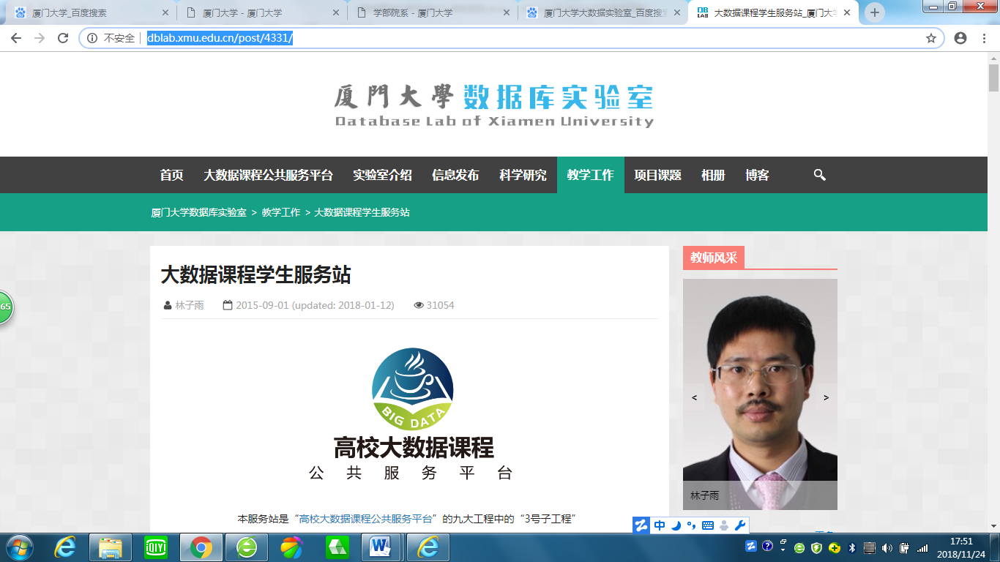{width="5.768055555555556in"
height="3.243195538057743in"}

大数据课程教师交流群网址http://dblab.xmu.edu.cn/post/4782/

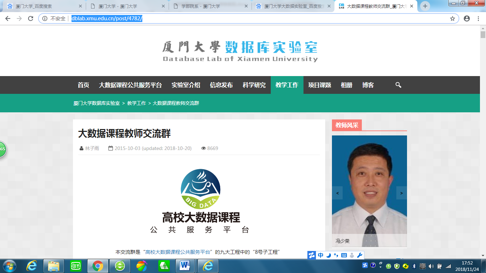{width="5.768055555555556in"
height="3.243195538057743in"}

**八、软件工程过程的实践要求**

1、根据上述的用户需求，进行需求分析，画出用例图，给出每个用例的用例描述，画出每个用例描述对应的（不带泳道）活动图。填写完整的需求规格说明书。

2、根据需求分析的结果（用例图和用例描述），设计系统的逻辑模型（包括：数据库的设计，实体类的类图，基于协作的类图，顺序图，协作图，状态图，（带泳道）活动图）。每个类要定义好"类的名字，类的属性名及数据类型，类的方法名及数据类型"。

3、根据系统的逻辑模型，设计系统的物理模型（包括：组件图，包图，部署图）。填写完整的软件需求及系统设计规格书。

4、选择Java
EE平台，使用Java/JavaScritp语言和JSP技术，开发系统（指《面向对象分析与设计（UML）》在线开放课程网站）。填写完整的系统操作指南和用户手册。

5、运用Rational Unified
Process（RUP，Rational统一过程）的生命周期模型，指导整个项目的开发。

RUP的软件开发生命周期模型如下。

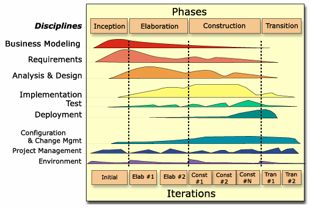{width="5.64924978127734in"
height="3.7916666666666665in"}

RUP把软件开发生命周期划分为多个Cycles。每个Cycle生成一个产品的新的版本。每个Cycle都依次由四个连续的阶段(phase)组成。

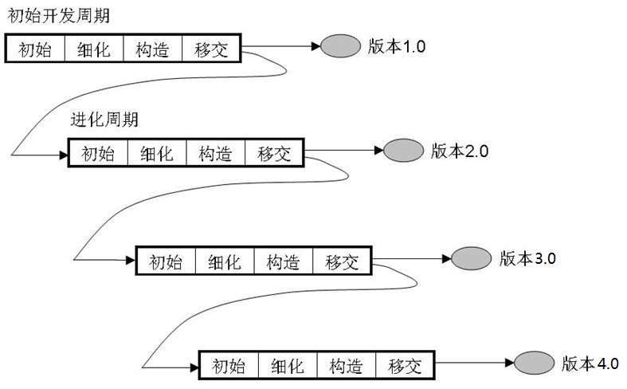{width="5.768055555555556in"
height="3.576388888888889in"}

**九、验收要求**

1、版本1.0，提交仅仅显示全部操作界面的可运行的软件系统。

版本2.0，提交完成了数据库设计、显示全部静态页面的可运行的软件系统。

版本3.0，提交显示全部动态页面（含文档下载和文档上传）的可运行的软件系统。

版本4.0，提交完成了剩余设计要求及功能的、完整的可运行的软件系统。

2、分组要求：十个人一组。

学号01\~10为第一组，学号11\~20为第二组，学号21\~30为第三组，学号31\~40为第四组，学号41\~50为第五组，学号51\~60为第六组，学号61\~70为第七组，其余类推。

不足十人的分别均匀地插入到其他组中。

软件工程普通班（1班），分5组。软件工程卓越班（卓越1班、卓越2班），合起来分6组。

3、每个组，学生自由选出一名组长，二名副组长。负责任务分工，阶段答辩安排，进度跟踪，过程管理等活动。

4、时间安排：第14周\~第18周。8B407，8B408。

5、需求分析阶段（第14周）结束后，进行Cycle
1的验收。各组分别演示版本1.0的运行效果，提交需求规格说明书，阶段1答辩。

特别提示：所有组各自独立完成阶段1的实践任务。

特别提示：根据所有组提交的版本1.0，选择一个比较理想的方案，作为最终系统用户界面的方案。后续软件功能的开发，都是基于这个统一的系统用户界面。

6、系统分析与设计阶段1（第15周）结束后，进行Cycle
2的验收。不同的组分别演示各自负责的功能模块的版本2.0的运行效果，提交软件需求规格说明书和软件系统设计文档，阶段2答辩。

特别提示：本阶段进行静态页面的可运行的软件系统的设计与实现。

特别提示：软件系统设计文档，包括：逻辑模型和物理模型。

特别提示：各组负责的功能模块划分如下：

普通班：第一组，课程概况。第二组，教师队伍。第三组，教学安排+教学互动。第四组，网站首页+教学研究改革+教学资源。第五组，教学管理+教学效果。各组负责的功能模块，要完成客户端（前台）+管理端（后台）。

卓越班：第一组，教学安排+教学互动。第二组，网站首页+教学资源。第三组，教学管理+教学效果。第四组，课程概况。第五组，教师队伍。第六组，教学研究改革。各组负责的功能模块，要完成客户端（前台）+管理端（后台）。

7、系统分析与设计阶段2（第16周）结束后，进行Cycle
3的验收。不同的组分别演示各自负责的功能模块的版本3.0的运行效果，提交软件需求规格说明书和软件系统设计文档，阶段3答辩。

特别提示：本阶段进行动态页面（含文档下载和文档上传）的可运行的软件系统的设计与实现。

特别提示：软件系统设计文档，包括：逻辑模型和物理模型。

特别提示：各组负责的功能模块划分如下：

普通班：第一组，课程概况。第二组，教师队伍。第三组，教学安排+教学互动。第四组，网站首页+教学研究改革+教学资源。第五组，教学管理+教学效果。各组负责的功能模块，要完成客户端（前台）+管理端（后台）。

卓越班：第一组，教学安排+教学互动。第二组，网站首页+教学资源。第三组，教学管理+教学效果。第四组，课程概况。第五组，教师队伍。第六组，教学研究改革。各组负责的功能模块，要完成客户端（前台）+管理端（后台）。

8、系统分析与设计阶段3（第17周\~第18周）结束后，进行Cycle
4的验收。不同的组分别演示各自负责的功能模块的版本4.0的运行效果，提交软件需求规格说明书和软件系统设计文档，系统操作指南和用户手册，阶段4答辩。

特别提示：本阶段进行剩余的全部功能的可运行的软件系统的设计与实现。包括：视频播放，PPT播放，邮件联系，在线QQ互动，在线微信互动，自编界面的互动。

特别提示：将每个组各自开发的完整功能模块集成在一起，解决数据库设计上的冲突，修改相关页面中的字段名。使不同组开发的各自功能模块组装成一个整体。

特别提示：软件系统设计文档，包括：逻辑模型和物理模型。

特别提示：各组负责的功能模块划分如下：

普通班：第一组，课程概况。第二组，教师队伍。第三组，教学安排+教学互动。第四组，网站首页+教学研究改革+教学资源。第五组，教学管理+教学效果。各组负责的功能模块，要完成客户端（前台）+管理端（后台）。

卓越班：第一组，教学安排+教学互动。第二组，网站首页+教学资源。第三组，教学管理+教学效果。第四组，课程概况。第五组，教师队伍。第六组，教学研究改革。各组负责的功能模块，要完成客户端（前台）+管理端（后台）。

**十、评分标准**

1、各阶段验收，得各阶段的分值（满分100分）。权重分配如下：Cycle1阶段验收得分，占比20%。Cycle2阶段验收得分，占比20%。Cycle3阶段验收得分，占比20%。Cycle4阶段验收得分，占比40%。

2、每个Cycle阶段验收，得分标准：

2.1、Cycle1。是否网络版（满分40），是否JSP（满分10），是否做完全部界面（满分20），是否自设界面（满分15），界面显示风格（满分15）。

2.2、Cycle2。是否网络版（满分40），是否JSP（满分20），是否做完全部功能（满分40）。

2.3、Cycle3。是否网络版（满分20），是否JSP（满分20），是否做完全部功能（满分30），是否能够动态显示（满分30）。

2.4、Cycle4。是否网络版（满分20），是否JSP（满分20），是否做完全部功能（满分30），是否集成组装成功（满分30）。

3、每个模型设计阶段验收，得分标准：

3.1、各种模型图的图形符号表达正确的，得分20分。

3.2、各种模型图中的模型元素、元素之间关系的描述符合实际需求要求的，得分20分。

3.3、文档内容符合规范的，得分20分。

3.4、文档排版格式符合规范的，得分20分。

3.5、参加演示答辩者（小组自荐，可多人同时参与），得分10分。

3.6、实践过程中考勤记录，全勤者，得分10分。缺勤者，以10分为基数，按比例折扣。

4、在每个Cycle，每个小组进行成员互评，得分标准：

4.1、小组成员通过互评，评价每个成员在本Cycle中在各自小组中做出的贡献。

4.2、以十名学生为参考，1名A（95分），2名B（85分），3名C（75分），4名D（65分）。

4.3、指导教师可以根据各组中同学的实际表现，做适当的微调。

东莞理工学院计算机网络与安全学院

《软件需求分析与设计》课程组

2018年11月20日
