目录
====
-   [目录](#目录)
-   [1.引言](#引言)
    -   [1.1编写目的](#编写目的)
    -   [1.2项目背景](#项目背景)
    -   [1.3定义](#定义)
-   [2.任务概述](#任务概述)
    -   [2.1产品介绍](#产品介绍)
    -   [2.2产品目标](#产品目标)
    -   [2.3产品用户](#产品用户)
    -   [2.4技术要求](#技术要求)
-   [3.功能需求](#功能需求)
    -   [3.1客户端](#客户端前台)
    -   [3.2管理端](#管理端后台)
    -   [3.3领域实体](#领域实体)
-   [4.非功能需求](#非功能需求)
-   [5. 业务流程](#业务流程)
    -   [5.1前台页面操作流程](#前台页面操作流程)
    -   [5.2后台页面操作流程](#后台页面操作流程)
-   [6.需求建模](#需求建模)
    -   [6.1网站首页](#网站首页贤政)
        -   [功能描述](#功能描述)
        -   [用例图](#用例图)
        -   [用例描述](#用例描述)
    -   [6.2课程概况](#课程概况和泽)
        -   [功能描述](#功能描述-1)
        -   [用例图](#用例图-1)
        -   [用例描述](#用例描述-1)
    -   [6.3教师队伍](#教师队伍)
        -   [功能描述](#功能描述-2)
        -   [用例图](#用例图-2)
        -   [用例描述](#用例描述-2)
    -   [6.4教学安排](#教学安排)
        -   [功能描述](#功能描述-3)
        -   [用例图](#用例图-3)
        -   [用例描述](#用例描述-3)
    -   [6.5教学研究改革](#教学研究改革)
        -   [功能描述](#功能描述-4)
        -   [用例图](#用例图-4)
        -   [用例描述](#用例描述-4)
    -   [6.6教学资源](#教学资源)
        -   [功能描述](#功能描述-5)
        -   [用例图](#用例图-5)
    -   [6.7教学管理](#教学管理俊熙)
        -   [功能描述](#功能描述-6)
        -   [用例图](#用例图-6)
        -   [用例描述](#用例描述-5)
    -   [6.8教学效果](#教学效果)
        -   [功能描述](#功能描述-7)
        -   [用例图](#用例图-7)
        -   [用例描述](#用例描述-6)
    -   [6.9教学互动](#教学互动)
        -   [功能描述](#功能描述-8)
        -   [用例图](#用例图-8)
        -   [用例描述](#用例描述-7)
    -   [6.10登录及权限管理](#登录及权限管理)
        -   [功能描述](#功能描述-9)
        -   [用例图](#用例图-9)
-   [7.需求验证](#需求验证)
    -   [7.1功能需求跟踪能力矩阵](#功能需求跟踪能力矩阵)
    -   [7.2业务流程需求跟踪能力矩阵](#业务流程需求跟踪能力矩阵)
    -   [7.3约束条件需求跟踪能力矩阵](#约束条件需求跟踪能力矩阵)
-   [8.系统运行界面](#系统运行界面)
-   [9.其他需求](#其他需求)

1.引言  
=======

本说明书为《面向对象分析与设计(UML)》在线开放课程平台的用户需求说明文件。该说明书便于开发人员、维护人员、管理人员之间的交流、协作，并作为工作成果的原始依据，并且在向潜在用户传递软件功能、性能需求，使其能够判断该软件是否与自己的需求相关。

1.1编写目的
-----------

本说明书的预期读者为客户、系统设计人员和编码人员；为开发人员、维护人员、客户之间提供共同的协议而创立基础，指导软件功能的实现。

本需求规格说明书全面、概括性地描述了在线开放课程所要完成的工作，使得软件开发人员和用户对本系统中的业务流程及功能达成共识。通过本说明书可以全面了解在线开放课程所要完成的任务和所能达到的功能。

1.2项目背景
-----------

随着MOOC（慕课）在全世界范围内的普及，通过网络提供课程的在线学习和交流，已经成为了当今在线教育的潮流。中国各级政府（教育部及省教育厅）为了及时跟进时代发展潮流，提出了大力发展《普通本科高校"十三五"教学质量与教学改革工程建设实施方案》。以此提高调动广大教师投入教学建设与教学改革的积极性，提高教育教学水平和人才培养质量。

在此形势下，本项目《面向对象分析与设计(UML)》在线开放课程平台成功列入为2018年度广东省本科高校教学质量与教学改革工程项目和2017年校级质量工程项目。

1.3定义
-------

JSP：Java Server
Pages。中文意是是java服务器页面，是一种动态网页技术标准。

SQL：Structured Query
Language。中文意思是结构化查询语言，是一种数据库查询和程序设计语言，用于存取数据以及查询、更新和管理关系数据库系统。

UMLCourse：中文意思是UML课程，作为本项目的数据库名字。

2.任务概述
===========

2.1产品介绍
-----------

《面向对象分析与设计(UML)》在线开放课程平台是一种Web应用系统。客户通过浏览器，访问网站地址，就可以浏览信息、观看资源、互动交流。

2.2产品目标
-----------

《面向对象分析与设计(UML)》在线开放课程平台分前台操作和后台管理。

前台主要包括：网站首页，课程概况，教师队伍，教学安排，教学研究改革，教学资源，教学管理，教学效果，教学互动。

后台主要包括：前台全部页面中的动态内容的维护，账号维护，制订开课计划，教师班级管理。

2.3产品用户
-----------

本平台操作用户分：学生（即普通访客），教师，二级管理员，超级管理员。

2.4技术要求
-----------

1、基于Java/JavaScritp语言和JSP技术。JDK虚拟机，MySQL数据库，Web服务器Tomcat，数据库服务器Apache。

2、Win2000/XP/win7/win8/win2008 操作系统。

3、IE浏览器，Google Chrome浏览器，360浏览器等主流浏览器。

4、网络版的在线开放课程平台。从全省其他高校可以成功访问本平台，并进行相应的操作。

3.功能需求
===========

3.1客户端(前台)
-----------------

表1 客户端的功能需求

| 功能类别   | 功能名称，标识符   | 描述   | 
|:----|:----|:----|
| 登录  | login.html |登录 | 
| 注册  | register.html |注册 | 
| 网站主页  | index.html |平台的主页，可以跳转其他模块 | 
| 课程概况  | courseDetail-1.html |课程简介| 
|   | courseDetail-2.html |课程特色| 
|   | courseDetail-3.html |教材与参考资料 | 
|   | courseDetail-4.html |历史沿革  | 
| 教师队伍  | teacherTeam-1.html | 课程负责人| 
|   | teacherTeam-2.html | 课程教学团队| 
|   | teacherTeam-3.html | 主讲教师| 
|   | teacherTeam-4.html | 青年教师培养| 
| 教学安排  | educationalDetail-1.html | 教学大纲| 
|   | educationalDetail-2.html | 教学日历|
|   | educationalDetail-3.html | 教学内容|
|   | educationalDetail-4.html | 授课计划|
|   | educationalDetail-5.html | 教学难重点|
|   | educationalDetail-6.html | 教学方法与手段|
| 教学研究改革  | educationReformDetail-1.html | 教学改革措施| 
|   | educationReformDetail-2.html | 教学改革立项| 
|   | educationReformDetail-3.html | 教学改革成果| 
|   | educationReformDetail-4.html | 教学表彰和奖励| 
| 教学资源  | eduSource-1.html | 课程课件（可以观看PPT、PDF、WORD）| 
|   | eduSource-2.html | 教学录像（可以播放视频）| 
|   | eduSource-3.html | 习题库（单选题、多选题、是非题、填空题、简答题、简单分析题、系统分析题、计算机水平考试题集）| 
|   | eduSource-4.html | 案例库（实验环境，实验系统代码，实验安装操作手册）| 
|   | eduSource-5.html | 实验任务| 
|   | eduSource-6.html | 技术文档范本|
| 教学管理  | eduManageDetail-1.html | 开课计划| 
|   | eduManageDetail-2.html | 上课班级| 
|   | eduManageDetail-3.html | 班级花名册| 
|   | eduManageDetail-4.html | 班级成绩单| 
|   | eduManageDetail-5.html | 学生作业案例| 
| 教学效果  | teachEffectDetail-1.html | 校外专家评价|
|   | teachEffectDetail-2.html | 校内督导评价| 
|   | teachEffectDetail-3.html | 教师自我评价| 
|   | teachEffectDetail-4.html | 校内学生评价| 
|   | teachEffectDetail-5.html | 社会评价| 
|   | teachEffectDetail-6.html | 教学评估及相关文件|   
| 教学互动  | leavenote.html | 网站内的师生互动| 
|   | QQ.html | QQ群| 
|   | weChat.html | 微信群| 
请参考下面的内容，填写表格1。

1、网站首页。包括以下子功能：课程负责人，课程简介，课程特色，课程动态，教师团队（滚动展示），教学资源链接，友情链接。登录。

2、课程概况。包括以下子功能：课程简介，课程特色，教材与参考资料，历史沿革。

3、教师队伍。包括以下子功能：课程负责人，课程教学团队，主讲教师，青年教师培养。

4、教学安排。包括以下子功能：教学大纲，教学日历，教学内容，授课计划，教学难重点，教学方法与手段。

5、教学研究改革。包括以下子功能：教学改革措施，教学改革立项，教学改革成果，教学表彰和奖励。

6、教学资源。包括以下子功能：课程课件（可以观看PPT、PDF、WORD），教学录像（可以播放视频），习题库（单选题、多选题、是非题、填空题、简答题、简单分析题、系统分析题、计算机水平考试题集），案例库（实验环境，实验系统代码，实验安装操作手册），实验任务，技术文档范本。

7、教学管理。包括以下子功能：开课计划，上课班级，班级花名册，班级成绩单，学生作业案例。

8、教学效果。包括以下子功能：校外专家评价，校内督导评价，教师自我评价，校内学生评价，社会评价，教学评估及相关文件。

9、教学互动。包括以下子功能：微信群，QQ群，网站内的师生互动。

3.2管理端(后台)
-----------------

表2 管理端的功能需求

| 功能类别   | 功能名称，标识符   | 描述   | 
|:----|:----|:----|
| 登录   | 登录   | 管理员登录   | 
| 注册   | 注册   | 管理员注册   | 
| 页面内容维护   | 修改内容   | 后台管理界面，修改需要维护的内容   | 
|    | 显示后台界面   | 更新界面，前台显示更新的内容   | 
| 账号维护（超级管理员）   | 创建账号   | 创建二级管理员及教师账号   | 
|    | 管理账号   | 增删查二级管理员及教师账号   | 
|    | 修改密码   | 修改自己的登录密码   | 
|    | 修改密码   | 重置二级管理员及教师登录密码   | 
| 账号维护（二级管理员）   | 修改密码   | 修改自己的登录密码   | 
| 制定开课计划   | 创建计划   | 创建开课计划   | 
|    | 课程分配   | 为即将上课的课程分配教师和班级（行政自然班）   | 
| 教师班级管理   | 显示后台界面   | 教师登录，进入后台管理界面   | 
|    | 修改密码   | 修改登录密码   | 
|    | 录入内容   | 录入自己负责班级的学生名单、成绩和作业案例   | 
|    | 录入内容   | 手动录入和自动导入学生名单和成绩   | 
|    | 录入内容   | 上传学生作业案例   | 

请参考下面的内容，填写表格2。

1、前台全部页面的内容维护。

超级管理员，二级管理员，在前台登录，切换到一个新的后台系统管理界面。

超级管理员，二级管理员，可以管理前台全部页面的内容维护。举例来说，在后台更新了"课程简介"的内容，则前台会自动显示出更新后的内容。在后台上传了图片后，在前台也会在正确的位置上显示新的图片。

2、账号维护。

超级管理员，可以创建二级管理员账号。二级管理员，除了不能创建新帐号（二级管理员和教师）外，其他可以操作的功能，同超级管理员。超级管理员，可以增删查二级管理员账号。可以重置二级管理员登录密码。

超级管理员，可以为某个教师创建登录帐号和密码。保证该教师可以为自己的班级输入学生名单、成绩和作业案例。超级管理员，可以增删查教师账号。可以重置教师登录密码。

超级管理员，二级管理员，教师，可以修改自己的登录密码。

3、制订开课计划。

超级管理员，二级管理员，可以创建开课计划。为即将上课的课程分配教师和班级（行政自然班）。

4、教师班级管理。

教师，在前台登录，切换到一个新的后台系统管理界面。

成功进入系统后，可以修改自己的登录密码，可以录入自己负责班级的学生名单、成绩和作业案例。

可以手动录入和自动导入学生名单和成绩，可以上传学生作业案例。

3.3领域实体
-----------

1、参与者：普通访客，教师，二级管理员，超级管理员。

2、账号信息：账号，密码，类别，电子邮箱，手机。

类别分：教师，二级管理员，超级管理员。

3、教师信息：账号，密码，教师姓名，性别，出生日期，职称，邮箱，手机号码。

4、班级信息：班级编号，班级名称，年级，专业，班号。

5、学生信息：学号，学生姓名，性别，出生日期，籍贯，邮箱，手机号码。

6、学生成绩信息：学年度，课程编号，课程名称，班级编号，班级名称，教师姓名，学号，学生姓名，平时成绩，期中考试成绩，期末考试成绩，大作业成绩，总评成绩。

7、课程信息：课程编号，课程名称，学分，学时数。

8、课程负责人信息：姓名，性别，出生年月，最高学历，学位，专业，职称，职务，电话，Email，所在院系，通信地址，研究方向，简历。

9、教师队伍团队信息：姓名，性别，出生年月，职称，专业，学位，在教学中承担的工作。

10、教学内容信息：标题，发表时间，内容介绍。

11、教学改革立项信息：标题，发表时间，下载地址。

4.非功能需求
=============

表3 非功能需求

| 需求类别   | 需求名称，标识符   | 描述   | 
|:----|:----|:----|
| 用户界面需求   | 主页面及各子页面内容显示风格UI.1   | 文字清晰可见、图片路径正确、表格内容清晰可见、超链接使用正确   | 
|    | 教学资源子页面内容显示风格UI.2   | 可以实现文档下载，后台可以文档上传,同时可以实现视频播放，PPT播放   | 
|    | 教学互动子页面内容显示风格UI.3   | 可以实现QQ互动，微信互动，以及自编界面的师生互动   | 
| 约束条件需求   | 权限分类LC.1   | 拥有超级管理员权限，二级管理员权限，教师权限，访客权限   | 
|    | 初始化要求LC.2   | 系统初始化后，自动生成两个超级管理员账号   | 
|    | 超级管理员权限要求LC.3   | 只能修改自己的登录密码，不能删除其他的超级管理员，但可以修改二级管理员和教师的各自登录密码，可以删除二级管理员和教师   | 
|    | 二级管理员权限要求LC.4   | 只能修改自己的登录密码，不能删除其他的二级管理员账号和教师账号   | 
|    | 教师权限要求LC.5   | 只能修改自己的登录密码   | 
|    | 访客权限要求LC.6   | 不需要账号,在前台可以访问任何页面   | 
| 软硬件需求   | 软件要求SH.1   | 采用mysql数据库，浏览器IE7以上，操作系统无要求   | 
|    | 硬件要求SH.2   | 利用服务器等方式实现外网访问   | 
请参考下面的内容，填写表格3。

界面要求：

1、窗体内容显示风格1。文字、图片、表格、框架、超链接。

2、窗体内容显示风格2。文档下载，文档上传。

3、窗体内容显示风格3。视频播放，PPT播放。

4、窗体内容显示风格4。交流互动。邮件联系，在线QQ互动，在线微信互动，自编界面的互动。

约束条件"

1、超级管理员权限，二级管理员权限，教师权限，访客权限。

2、系统初始化后，生成两个超级管理员账号。

3、超级管理员，只能修改自己的登录密码，不能删除其他的超级管理员。

4、超级管理员，可以修改二级管理员和教师的各自登录密码，可以删除二级管理员和教师。

5、二级管理员，只能修改自己的登录密码，不能删除其他的二级管理员账号和教师账号。

6、教师，只能修改自己的登录密码。

7、访客，不需要账号。在前台可以访问任何页面。

5. 业务流程
===========

5.1前台页面操作流程
-------------------

1、普通页面。

1.1、访客打开任何一个普通页面。

1.2、可以观看页面中的内容。如果内容很多，可以分页显示，或者，右边滚动条拉动显示。

1.3、点击超链接，可以进入到下一个页面。

1.4、点击视频链接，可以调出视频播放器，播放视频。

5.2后台页面操作流程
-------------------

1、教师登录。

1.1、教师用自己的账号和密码登录。如果密码忘记，可以通过"邮件"方式，找回密码。新密码由超级管理员设置。

1.2、教师可以看到本学期自己正在上的课程。

1.3、教师可以选择正在上的课程的班级，录入该班级的学生名单（手动录入，自动导入）。

1.4、教师可以选择正在上的课程的班级，录入该班级的学生成绩（手动录入，自动导入）。

1.5、教师可以选择正在上的课程的班级，上传该班级的学生作业案例。

2、超级管理员、二级管理员登录。

2.1、超级管理员、二级管理员，用自己的账号和密码登录。如果密码忘记，可以通过"邮件"方式，找回密码。新密码由超级管理员设置。

2.2、可以在左侧功能导航树上，看到自己可以操作的功能模块。点击某个功能模块，可以输入相关信息。确认无误，保存后，在前台页面上能够正确地动态反映出来。

2.3、根据需要，超级管理员可以创建二级管理员账号和教师账号。

2.4、根据需要，超级管理员、二级管理员，可以创建开课计划。为即将上课的课程分配教师和班级（行政自然班）。分配教师指：输入教师的登录账号和教师本人姓名。分配班级指：输入班级的编号和班级名称。

2.5、根据需要，对于离职的二级管理员和教师，超级管理员通过重置密码而不告诉二级管理员和教师的方式，使得他们成为非法用户。

6.需求建模
===========

6.1网站首页
--------------

### 功能描述

包括以下子功能：课程负责人，课程简介，课程特色，课程动态，教师团队（滚动展示），教学资源链接，友情链接。登录。

### 用例图

### 用例描述

-   用例名称：登录

> 参与者：普通访客\
> 用例描述：普通访客登录系统\
> 前置条件：参与者必须已经打开登录界面。当参与者希望进入系统时，该用例开始执行\
> 后置条件：如果该用例成功结束，则什么信息也不会修改\
> 主事件流：\
>  ①参与者输入用户名和密码\
>  ②系统判断账号是否正确。如果与数据库连接有问题，则执行异常事件流e1\
>  ③如果用户名和密码有一个不正确，则执行异常事件流e2\
>  ④如果用户名和密码都正确，则进入系统主页面。本用例结束\
>  异常事件流e1：\
>  ①提示参与者数据库连接不上\
>  ②系统自动关闭，用例结束\
>  异常事件流e2：\
>  ①重新执行主事件流步骤一\
> 活动图： 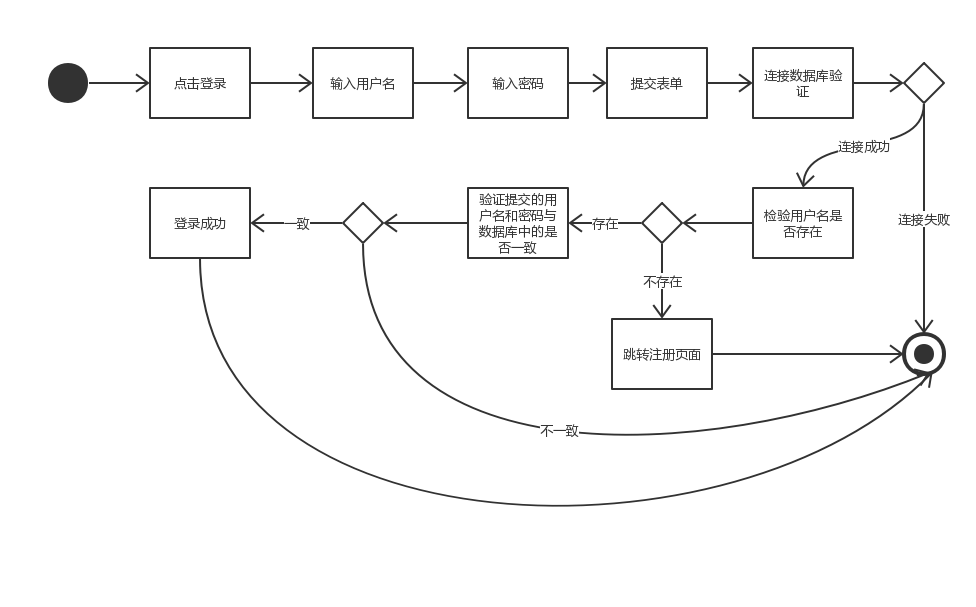

-   用例名称：注册

> 参与者：普通访客\
> 用例描述：普通访客注册账号\
> 前置条件：参与者必须已经打开注册界面。当参与者希望注册账户时，该用例开始执行\
> 后置条件：如果该用例成功结束，创建新用户的账户信息\
> 主事件流：\
>  ①参与者输入用户名、密码及确认密码\
>  ②系统判断用户名是否已经存在。如果与数据库连接有问题，则执行异常事件流e1\
>  ③如果用户名已经存在，则执行异常事件流e2\
>  ③如果密码和确认密码不一致，则执行异常事件流e2\
>  ④如果用户名未注册且密码与确认密码一致，则进入登录页面。本用例结束\
>  异常事件流e1：\
>  ①提示参与者数据库连接不上\
>  ②系统自动关闭，用例结束\
>  异常事件流e2：\
>  ①重新执行主事件流步骤一\
> 活动图： 

6.2课程概况
--------------

### 功能描述

包括以下子功能：课程简介，课程特色，教材与参考资料，历史沿革。

### 用例图

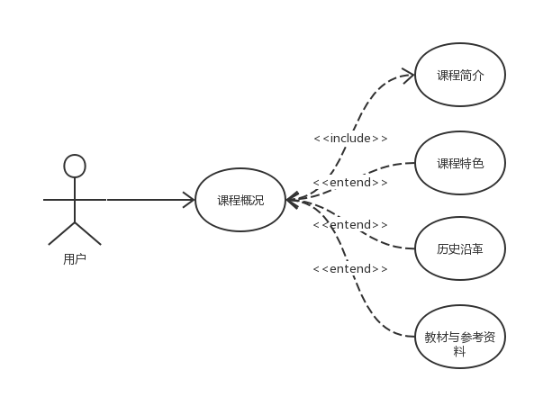

### 用例描述

- 用例名称：查看课程简介

> 参与者：普通访客\
> 用例描述：普通访客查看课程简介\
> 前置条件：参与者必须已经登录。当参与者希望查看课程简介时，该用例开始执行\
> 后置条件：如果该用例成功结束，则返回课程简介\
> 主事件流：\
>  ①参与者点击课程简介\
>  ②系统与数据库连接查找课程简介信息，若连接数据库失败，则执行异常事件流e1\
>  ③数据库连接成功，则返回课程简介信息。本用例结束\
>  异常事件流e1：\
>  ①提示参与者数据库连接不上\
>  ②系统自动关闭，用例结束\
> 活动图：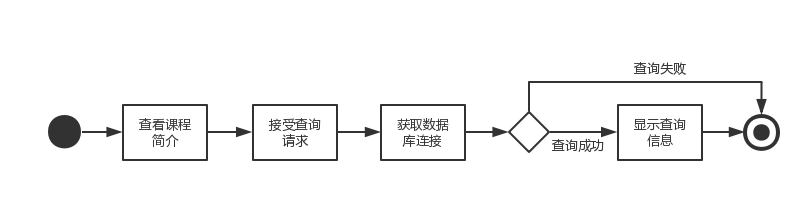

- 用例名称：查看课程特色

> 参与者：普通访客\
> 用例描述：普通访客查看课程特色\
> 前置条件：参与者必须已经登录。当参与者希望查看课程特色时，该用例开始执行\
> 后置条件：如果该用例成功结束，则返回课程特色\
> 主事件流：\
>  ①参与者点击课程特色\
>  ②系统与数据库连接查找课程特色信息，若连接数据库失败，则执行异常事件流e1\
>  ③数据库连接成功，则返回课程特色信息。本用例结束\
>  异常事件流e1：\
>  ①提示参与者数据库连接不上\
>  ②系统自动关闭，用例结束\
> 活动图：

- 用例名称：查看教材与参考资料

> 参与者：普通访客\
> 用例描述：普通访客查看教材与参考资料\
> 前置条件：参与者必须已经登录。当参与者希望查看教材与参考资料时，该用例开始执行\
> 后置条件：如果该用例成功结束，则返回教材与参考资料\
> 主事件流：\
>  ①参与者点击教材与参考资料\
>  ②系统与数据库连接查找教材与参考资料信息，若连接数据库失败，则执行异常事件流e1\
>  ③数据库连接成功，则返回教材与参考资料信息。本用例结束\
>  异常事件流e1：\
>  ①提示参与者数据库连接不上\
>  ②系统自动关闭，用例结束\
> 活动图：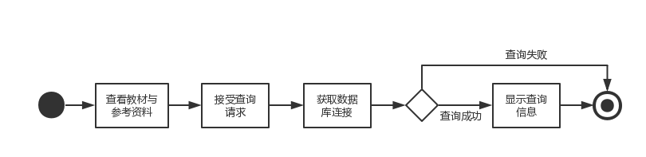

- 用例名称：查看历史沿革

> 参与者：普通访客\
> 用例描述：普通访客查看历史沿革\
> 前置条件：参与者必须已经登录。当参与者希望查看历史沿革时，该用例开始执行\
> 后置条件：如果该用例成功结束，则返回历史沿革\
> 主事件流：\
>  ①参与者点击历史沿革\
>  ②系统与数据库连接查找历史沿革信息，若连接数据库失败，则执行异常事件流e1\
>  ③数据库连接成功，则返回历史沿革信息。本用例结束\
>  异常事件流e1：\
>  ①提示参与者数据库连接不上\
>  ②系统自动关闭，用例结束\
> 活动图：

6.3教师队伍
--------------

### 功能描述

包括以下子功能：课程负责人，课程教学团队，主讲教师，青年教师培养。

### 用例图

### 用例描述

-   用例名称：查看课程负责人

> 参与者：普通访客\
> 用例描述：普通访客查看课程负责人\
> 活动图： 

-   用例名称：查看课程教学团队

> 参与者：普通访客\
> 用例描述：普通访客查看课程教学团队\
> 活动图： 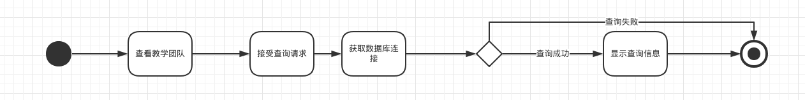

-   用例名称：查看主讲教师

> 参与者：普通访客\
> 用例描述：普通访客查看主讲教师\
> 活动图： 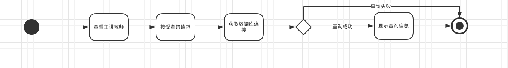

-   用例名称：查看青年教师培养

> 参与者：普通访客\
> 用例描述：普通访客查看青年教师培养\
> 活动图： 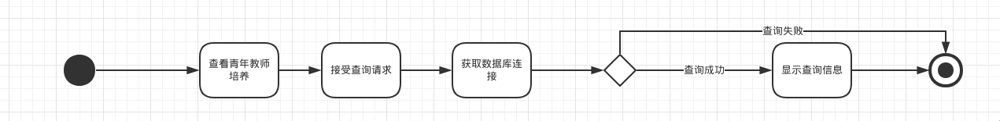

6.4教学安排
--------------------

### 功能描述

包括以下子功能：教学大纲，教学日历，教学内容，授课计划，教学难重点，教学方法与手段。

### 用例图

### 用例描述

-   用例名称：查看教学大纲

> 参与者：普通访客\
> 用例描述：普通访客查看教学大纲\
> 活动图： 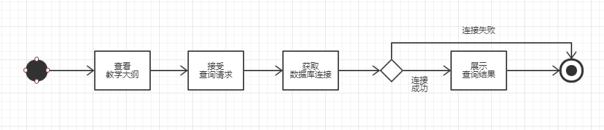

-   用例名称：查看教学内容

> 参与者：普通访客\
> 用例描述：普通访客查看教学内容\
> 活动图： 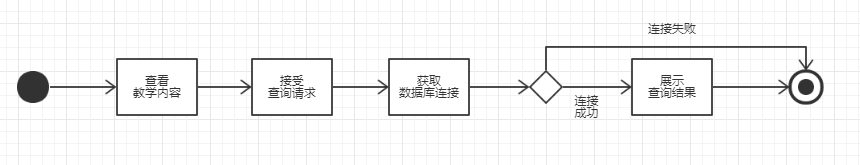

-   用例名称：查看教学日历

> 参与者：普通访客\
> 用例描述：普通访客查看教学日历\
> 活动图： 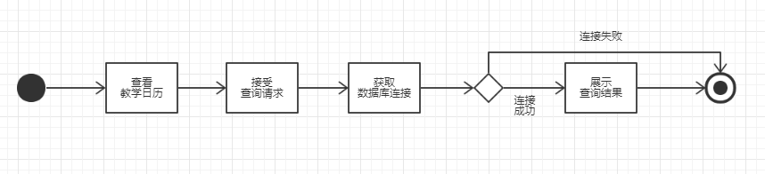

-   用例名称：查看授课计划

> 参与者：普通访客\
> 用例描述：普通访客查看授课计划\
> 活动图： 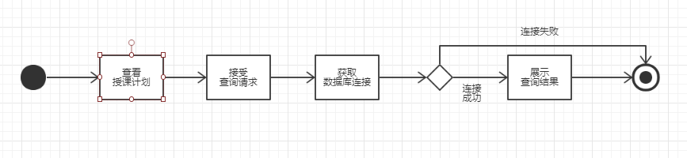

-   用例名称：查看教学重难点

> 参与者：普通访客\
> 用例描述：普通访客查看教学重难点\
> 活动图： 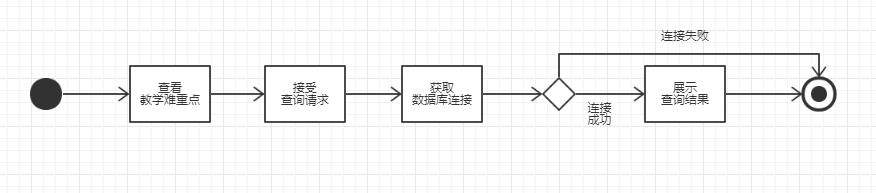

-   用例名称：查看教学方法与手段

> 参与者：普通访客\
> 用例描述：普通访客查看教学方法与手段\
> 活动图：
> 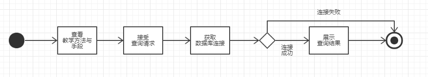

-   用例名称：上传教学大纲

> 参与者：管理员\
> 用例描述：管理员上传教学大纲\
> 前置条件：登陆成功\
> 基本事件流：  
①管理员登陆   
②点击修改教学计划  
③上传教学大纲  
④跳转到教学大纲显示页面
> 

-   用例名称：上传教学内容

> 参与者：管理员\
> 用例描述：管理员上传教学内容\
> 前置条件：登陆成功\
> 基本事件流：  
①管理员登陆  
②点击修改教学计划  
③上传教学内容  
④跳转到教学内容显示页面
> 

-   用例名称：上传教学日历

> 参与者：管理员\
> 用例描述：管理员上传教学日历\
> 前置条件：登陆成功\
> 基本事件流：  
①管理员登陆  
②点击修改教学计划  
③上传教学日历  
④跳转到教学日历显示页面
> 

-   用例名称：上传授课计划

> 参与者：管理员\
> 用例描述：管理员上传授课计划\
> 前置条件：登陆成功\
> 基本事件流：  
①管理员登陆   
②点击修改教学计划   
③上传授课计划  
④跳转到教学计划显示页面
> 

-   用例名称：上传教学重难点

> 参与者：管理员\
> 用例描述：管理员上传教学重难点\
> 前置条件：登陆成功\
> 基本事件流：  
①管理员登陆   
②点击修改教学计划  
③上传教学重难点  
④跳转到教学重难点显示页面
> 

-   用例名称：上传教学方法与手段

> 参与者：管理员\
> 用例描述：管理员上传教学方法与手段\
> 前置条件：登陆成功\
> 基本事件流：  
①管理员登陆  
②点击修改教学计划  
③上传教学方法与手段  
④跳转到教学方法与手段显示页面
> 

6.5教学研究改革
------------------

### 功能描述

包括以下子功能：教学改革措施，教学改革立项，教学改革成果，教学表彰和奖励。

### 用例图

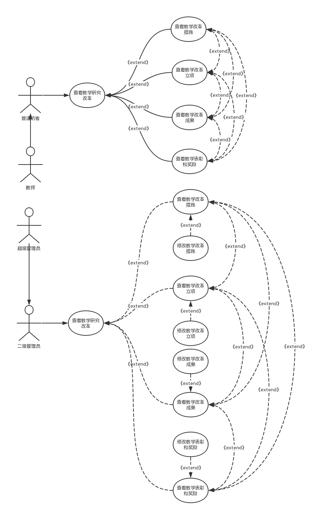

### 用例描述

-   用例名称：查看教学研究改革

> 参与者：普通访客\
> 用例描述：普通访客查看教学研究改革\
> 前置条件：参与者必须已经登录。当参与者希望查看教学研究改革时，该用例开始执行\
> 后置条件：如果该用例成功结束，则返回教学研究改革信息\
> 主事件流：\
>  ①参与者点击教学研究改革\
>  ②系统与数据库连接查找教学研究改革信息，若连接数据库失败，则执行异常事件流e1\
>  ③数据库连接成功，则返回教学研究改革信息。本用例结束\
>  异常事件流e1：\
>  ①提示参与者数据库连接不上\
>  ②系统自动关闭，用例结束\
> 活动图： 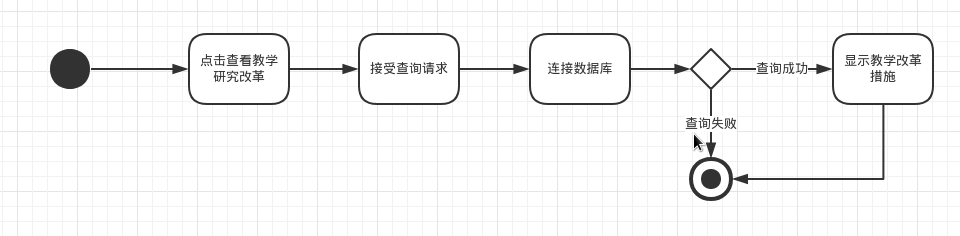

-   用例名称：查看教学改革措施

> 参与者：普通访客\
> 用例描述：普通访客查看教学改革措施\
> 前置条件：参与者必须已经登录。当参与者希望查看教学改革措施时，该用例开始执行\
> 后置条件：如果该用例成功结束，则返回教学改革措施信息\
> 主事件流：\
>  ①参与者点击教学改革措施\
>  ②系统与数据库连接查找教学改革措施信息，若连接数据库失败，则执行异常事件流e1\
>  ③数据库连接成功，则返回教学改革措施信息。本用例结束\
>  异常事件流e1：\
>  ①提示参与者数据库连接不上\
>  ②系统自动关闭，用例结束\
> 活动图： 

-   用例名称：查看教学改革立项

> 参与者：普通访客\
> 用例描述：普通访客查看教学改革立项\
> 前置条件：参与者必须已经登录。当参与者希望查看教学改革立项时，该用例开始执行\
> 后置条件：如果该用例成功结束，则返回教学改革立项信息\
> 主事件流：\
>  ①参与者点击教学改革立项\
>  ②系统与数据库连接查找教学改革立项信息，若连接数据库失败，则执行异常事件流e1\
>  ③数据库连接成功，则返回教学改革立项信息。本用例结束\
>  异常事件流e1：\
>  ①提示参与者数据库连接不上\
>  ②系统自动关闭，用例结束\
> 活动图： 

-   用例名称：查看教学改革成果

> 参与者：普通访客\
> 用例描述：普通访客查看教学改革成果\
> 前置条件：参与者必须已经登录。当参与者希望查看教学改革成果时，该用例开始执行\
> 后置条件：如果该用例成功结束，则返回教学改革成果信息\
> 主事件流：\
>  ①参与者点击教学改革成果\
>  ②系统与数据库连接查找教学改革成果信息，若连接数据库失败，则执行异常事件流e1\
>  ③数据库连接成功，则返回教学改革成果信息。本用例结束\
>  异常事件流e1：\
>  ①提示参与者数据库连接不上\
>  ②系统自动关闭，用例结束\
> 活动图： 

-   用例名称：查看教学表彰和奖励

> 参与者：普通访客\
> 用例描述：普通访客查看教学表彰和奖励\
> 前置条件：参与者必须已经登录。当参与者希望查看教学表彰和奖励时，该用例开始执行\
> 后置条件：如果该用例成功结束，则返回教学表彰和奖励信息\
> 主事件流：\
>  ①参与者点击教学表彰和奖励\
>  ②系统与数据库连接查找教学表彰和奖励信息，若连接数据库失败，则执行异常事件流e1\
>  ③数据库连接成功，则返回教学表彰和奖励信息。本用例结束\
>  异常事件流e1：\
>  ①提示参与者数据库连接不上\
>  ②系统自动关闭，用例结束\
> 活动图： 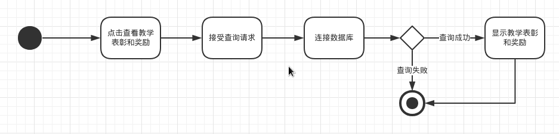

6.6教学资源
----------------

### 功能描述

包括以下子功能：课程课件（可以观看PPT、PDF、WORD），教学录像（可以播放视频），习题库（单选题、多选题、是非题、填空题、简答题、简单分析题、系统分析题、计算机水平考试题集），案例库（实验环境，实验系统代码，实验安装操作手册），实验任务，技术文档范本。

### 用例图

### 用例描述

-   用例名称：查看课程课件

> 参与者：普通访客\
> 用例描述：普通访客查看课程课件\
> 前置条件：参与者必须已经登录。当参与者希望查看教学改革成果时，该用例开始执行\
> 后置条件：如果该用例成功结束，则返回教学改革成果信息\
> 主事件流：\
>  ①参与者点击课程课件\
>  ②系统与数据库连接查找课程课件信息信息，若连接数据库失败，则执行异常事件流e1\
>  ③数据库连接成功，则显示课件内容。本用例结束\
>  异常事件流e1：\
>  ①提示参与者数据库连接不上\
>  ②系统自动关闭，用例结束\
> 活动图： 

-   用例名称：课程课件增删改查

> 参与者：教师、管理员\
> 用例描述：教师或管理员对课程课件信息进行管理\
> 前置条件：参与者必须已经登录。当参与者希望对课程课件内容进行管理时，该用例开始执行\
> 后置条件：如果该用例成功结束，则返回修改后的课程课件信息\
> 主事件流：\
>  ①参与者点击课程课件管理\
>  ②系统与数据库连接查找课程课件信息信息，若连接数据库失败，则执行异常事件流e1\
>  ③对课程课件内容进行管理，参与者可以进行对发布课件的增删改查操作。
>  ④参与者提交修改，若数据库连接成功，且返回课程课件信息，本用例结束\
>  异常事件流e1：\
>  ①提示参与者数据库连接不上\
>  ②系统回退到未修改课件显示界面，用例结束\
> 活动图： 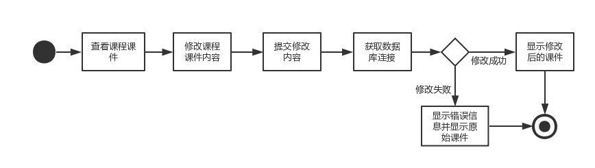

-   用例名称：查看教学录像

参与者：普通访客

用例描述：普通访客查看课程录像

前置条件：参与者必须已经登录。当参与者希望查看教学录像时，该用例开始执行

后置条件：如果该用例成功结束，则返回教学录像

主事件流：

①参与者点击教学录像

②系统与数据库连接查找教学录像信息，若连接数据库失败，则执行异常事件流e1

③数据库连接成功，则显示教学录像。本用例结束

异常事件流e1：

①提示参与者数据库连接不上

②系统自动关闭，用例结束

活动图：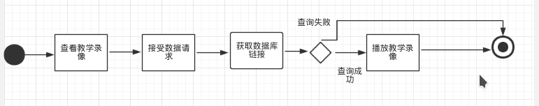{width="5.704305555555556in"
height="1.1245844269466316in"}

-   用例名称：教学录像增删改查

参与者：教师、管理员

用例描述：教师或管理员对教学录像信息进行管理

前置条件：参与者必须已经登录。当参与者希望对教学录像内容进行管理时，该用例开始执行

后置条件：如果该用例成功结束，则返回修改后的教学录像信息

主事件流：

①参与者点击教学录像管理

②系统与数据库连接查找教学录像信息，若连接数据库失败，则执行异常事件流e1

③对课程课件内容进行管理，参与者可以进行对发布的教学录像增删改查操作。

④参与者提交修改，若数据库连接成功，且返回教学录像信息，本用例结束

异常事件流e1：

①提示参与者数据库连接不上

②系统回退到未修改课件显示界面，用例结束

活动图： {width="5.704305555555556in"
height="1.3181266404199474in"}

-   用例名称：查看习题库

参与者：普通访客

用例描述：普通访客查看习题库

前置条件：参与者必须已经登录。当参与者希望查看习题库时，该用例开始执行

后置条件：如果该用例成功结束，则返回习题库

主事件流：

①参与者点击习题库

②系统与数据库连接查找习题库信息，若连接数据库失败，则执行异常事件流e1

③数据库连接成功，则显示习题库。本用例结束

异常事件流e1：

①提示参与者数据库连接不上

②系统自动关闭，用例结束

活动图：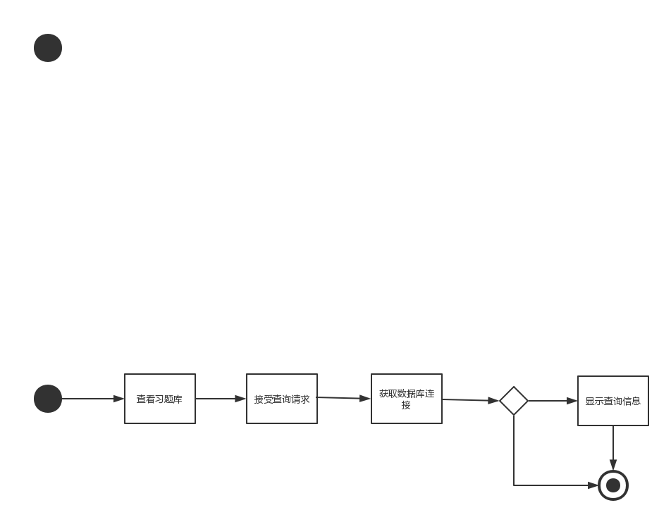{width="5.695in"
height="1.5819444444444444in"}

-   用例名称：习题库增删改查

参与者：教师、管理员

用例描述：教师或管理员对习题库信息进行管理

前置条件：参与者必须已经登录。当参与者希望对习题库内容进行管理时，该用例开始执行

后置条件：如果该用例成功结束，则返回修改后的习题库信息

主事件流：

①参与者点击习题库管理

②系统与数据库连接查找习题库信息，若连接数据库失败，则执行异常事件流e1

③对课程课件内容进行管理，参与者可以进行对发布的习题库增删改查操作。

④参与者提交修改，若数据库连接成功，且返回习题库信息，本用例结束

异常事件流e1：

①提示参与者数据库连接不上

②系统回退到未修改课件显示界面，用例结束

活动图： 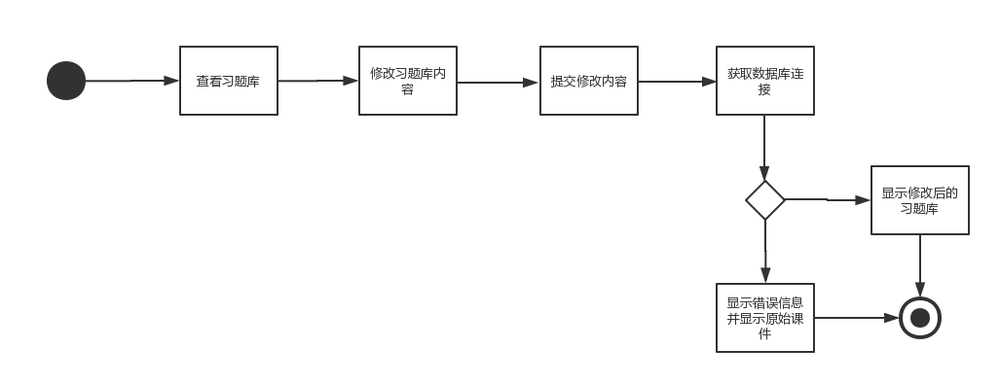{width="5.695in"
height="2.1848392388451443in"}

-   用例名称：查看案例库

参与者：普通访客

用例描述：普通访客查看案例库

前置条件：参与者必须已经登录。当参与者希望查看案例库时，该用例开始执行

后置条件：如果该用例成功结束，则返回案例库数据

主事件流：

①参与者点击案例库

②系统与数据库连接查找课程课件信息信息，若连接数据库失败，则执行异常事件流e1

③数据库连接成功，则显示案例库。本用例结束

异常事件流e1：

①提示参与者数据库连接不上

②系统自动关闭，用例结束

活动图：

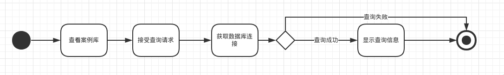{width="5.695in"
height="0.8495308398950131in"}

-   用例名称：案例库资源增删改查

参与者：教师、管理员

用例描述：教师或管理员对案例库资源信息进行管理

前置条件：参与者必须已经登录。当参与者希望对案例库资源内容进行管理时，该用例开始执行

后置条件：如果该用例成功结束，则返回修改后的案例库信息

主事件流：

①参与者点击案例库资源管理

②系统与数据库连接查找案例库信息，若连接数据库失败，则执行异常事件流e1

③对课程案例库内容进行管理，参与者可以进行对案例库的增删改查操作。

④参与者提交修改，若数据库连接成功，且返回课程课件信息，本用例结束

异常事件流e1：

①提示参与者数据库连接不上

②系统回退到未修改课件显示界面，用例结束

活动图： 

{width="5.695in"
height="1.363675634295713in"}

-   用例名称：查看实验任务

参与者：普通访客

用例描述：普通访客查看实验任务

前置条件：参与者必须已经登录。当参与者希望查看案例库时，该用例开始执行

后置条件：如果该用例成功结束，则返回实验任务

主事件流：

①参与者点击查看实验任务

②系统与数据库连接查找实验任务信息，若连接数据库失败，则执行异常事件流e1

③数据库连接成功，则显示实验任务。本用例结束

异常事件流e1：

①提示参与者数据库连接不上

②系统自动关闭，用例结束

活动图：

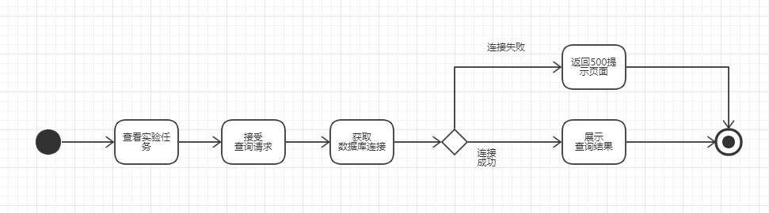{width="5.695in"
height="1.5835739282589676in"}

-   用例名称：实验任务增删改查

参与者：教师、管理员

用例描述：教师或管理员对实验任务资源信息进行管理

前置条件：参与者必须已经登录。当参与者希望对实验任务资源进行管理时，该用例开始执行

后置条件：如果该用例成功结束，则返回修改后的实验任务信息

主事件流：

①参与者点击实验任务资源管理

②系统与数据库连接查找实验任务信息，若连接数据库失败，则执行异常事件流e1

③对实验任务内容进行管理，参与者可以进行对实验任务的增删改查操作。

④参与者提交修改，若数据库连接成功，且返回实验任务信息，本用例结束

异常事件流e1：

①提示参与者数据库连接不上

②系统回退到修改前的实验任务显示界面，用例结束

活动图： 

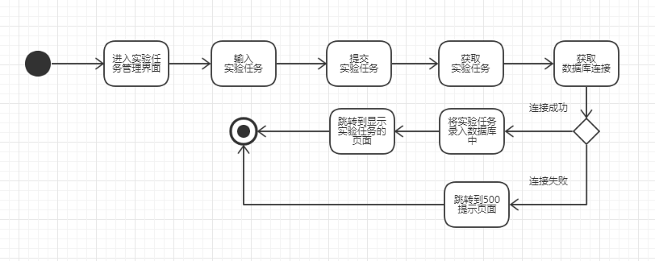{width="5.695in"
height="2.272389545056868in"}

**技术文档范本**

1. 技术总体选择：

    基于Java/JavaScritp语言和JSP技术。MySQL数据库，Web服务器Tomcat，数据库服务器Apache

1. 项目使用技术：
    a.  项目版本ver1.0
        用户界面开发：html布局，Java/JavaScritp语言，视频插件；

2.  软件支持：

    | 类型   | 软件   | 
    |:----|:----|
    | 浏览器   | IE浏览器，Google Chrome浏览器，360浏览器等主流浏览器   | 
    | 应用服务器   | Web服务器Tomcat，数据库服务器Apache   | 
    | 开发工具   | myEclipse   | 
    | Database    | mysql   | 

1.  子功能技术使用情况：

    b.  课程课件：使用html布局，Java/JavaScritp语言渲染界面动态效果；  
    c.  教学录像：使用html布局，Java/JavaScritp语言渲染界面动态效果，调用视频插件播放教学资源视频；  
    d.  习题库：使用html布局，Java/JavaScritp语言渲染界面动态效果；  
    e.  案例库：使用html布局，Java/JavaScritp语言渲染界面动态效果；  
    f.  实验任务：使用html布局，Java/JavaScritp语言渲染界面动态效果；  

6.7教学管理
--------------

### 功能描述

包括以下子功能：开课计划，上课班级，班级花名册，班级成绩单，学生作业案例。

### 用例图

### 用例描述

-   用例名称：开课计划

> 参与者：管理员\
> 用例描述：展示已有的开课计划，提供浏览，创建，修改功能，完成编辑后分配课程给教师与班级\

> 活动图： 

-   用例名称：浏览上课班级

> 参与者：教师\
> 用例描述：展示一名教师所负责的上课班级列表，能查看对应班级的信息\
> 活动图： 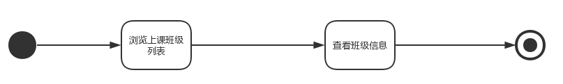

-   用例名称：学生成绩增删改查

> 参与者：教师\
> 用例描述：展示一名教师所负责的上课班级列表，能查看，导入，修改，删除对应班级的学生成绩\
> 活动图： 

-   用例名称：班级名册增删改查

> 参与者：教师\
> 用例描述：展示一名教师所负责的上课班级列表，能查看，导入，修改，删除对应班级的学生名册\
> 活动图： 

-   用例名称：学生作业案例增删改查

> 参与者：教师\
> 用例描述：展示已有的学生作业案例，能查看，导入，修改，删除学生作业案例\
> 活动图： 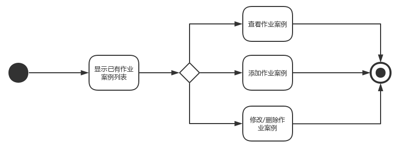

6.8教学效果
--------------

### 功能描述

包括以下子功能：校外专家评价，校内督导评价，教师自我评价，校内学生评价，社会评价，教学评估及相关文件。

### 用例图

### 用例描述

-   用例名称：查看校外专家评价

> 参与者：普通访客\
> 用例描述：普通访客查看校外专家评价\
> 活动图： 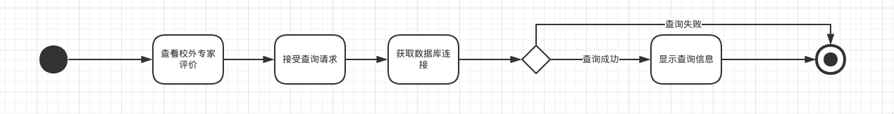

-   用例名称：查看校内监督评价

> 参与者：普通访客\
> 用例描述：普通访客查看校内监督评价\
> 活动图： 

-   用例名称：查看教师自我评价

> 参与者：普通访客\
> 用例描述：普通访客查看教师自我评价\
> 活动图： 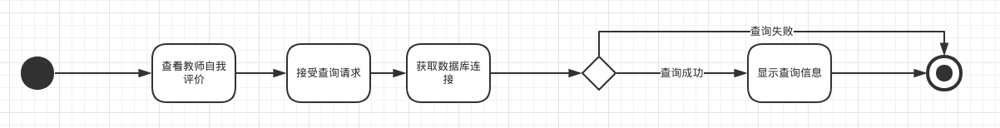

-   用例名称：查看校内学生评价

> 参与者：普通访客\
> 用例描述：普通访客查看校内学生评价\
> 活动图： 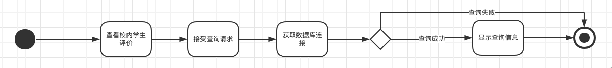

-   用例名称：查看社会评价

> 参与者：普通访客\
> 用例描述：普通访客查看社会评价\
> 活动图： 

-   用例名称：查看教学评估及相关文件

> 参与者：普通访客\
> 用例描述：普通访客查看教学评估及相关文件\
> 活动图：
> 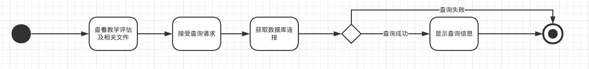

6.9教学互动
--------------

### 功能描述

包括以下子功能：微信群，QQ群，网站内的师生互动。

### 用例图

### 用例描述

-   用例名称：QQ群

>参与者：用户\
>用例描述：用户点击QQ群，显示QQ群二维码信息。\
>前置条件：系统正常工作\
>后置条件：显示QQ群二维码\
>主事件流：\
>①用户点击QQ群超链接。\
>②显示QQ群二维码信息。\
>活动图：

-   用例名称：微信群

>参与者:用户\
>用例描述:用户点击微信群，显示微信群二维码信息。\
>前置条件：系统正常工作\
>后置条件：显示微信群二维码信息。\
>主事件流：\
>①用户点击微信群超链接。\
>②显示微信群二维码信息。\
>活动图：

-   用例名称：显示评论

>参与者:用户\
>用例描述：用户点击师生互动，从数据库中搜索所有评论信息，分页显示。\
>前置条件：系统正常工作\
>后置条件：显示已有评论\
>主事件流：\
>①用户点击师生互动超链接。\
>②从数据库中搜索所有评论信息，分页显示。\
>活动图:

-   用例名称：留言回复

>参与者:已登录用户\
>用例描述：已登录用户可留言或者回复
>前置条件：已经登录。\
>后置条件：上传到数据库并显示。\
>主事件流:\
>①在文本框输入文字，点击发表评论。\
>②判断是留言还是回复。\
>a1.若是留言，记录已登录用户的个人信息以及文字上传到后端。\
>a2.若是回复，记录已登录用户的个人信息、回复对象的个人信息、文字上传到后端。\
>③显示已有的评论信息。\
>活动图:

6.10登录及权限管理
--------------------

### 功能描述

包括以下子功能:登录,注册,找回密码

### 用例图

### 用例描述

-   用例名称：登录

> 参与者：教师,二级管理员,超级管理员
> 用例描述：用户在登录页面登录
> 活动图： 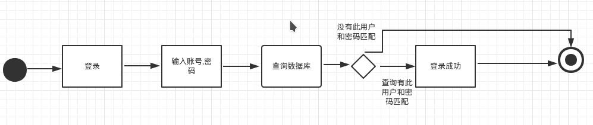

-   用例名称：注册

> 参与者：游客
> 用例描述：用户在注册页面注册
> 活动图： 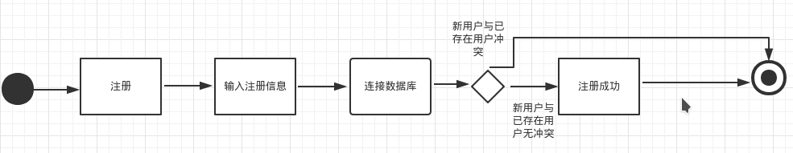

-   用例名称：找回密码

> 参与者：教师,二级管理员,超级管理员
> 用例描述：用户忘记密码进行找回
> 活动图： 

-   用例名称：登录

> 参与者：教师,二级管理员,超级管理员\
> 用例描述：用户在登录页面登录\
> 前置条件：用户点击登录或用到登录权限\
> 基本事件流：①输入账号密码②点击登录

-   用例名称：注册

> 参与者：游客\
> 用例描述：游客在注册页面注册\
> 前置条件：用户点击注册\
> 基本事件流：①输入注册信息 ②点击注册

-   用例名称：找回密码

> 参与者：教师,二级管理员,超级管理员\
> 用例描述：用户忘记密码进行找回\
> 前置条件：用户密码忘记\
> 基本事件流：①输入注册时的邮箱 ②重新设置密码

7.需求验证
===========

7.1功能需求跟踪能力矩阵
-----------------------

表4 功能需求跟踪能力矩阵

| 项目名称：在线开放课程平台   |    |    |    |    | 
|:----:|:----:|:----:|:----|:----|
| 序号   | 需求项名称   | 功能名称   |    |    | 
|    |    | 中功能   | 小功能   | 状态   | 
| 1   | 网站首页信息管理   | 网站首页信息展示   | 展示课程负责人   |    | 
| 2   |    |    | 展示课程简介   |    | 
| 3   |    |    | 展示课程特色   |    | 
| 4   |    |    | 展示课程动态   |    | 
| 5   |    |    | 展示教师团队   |    | 
| 6   |    |    | 展示教学资源链接   |    | 
| 7   |    |    | 展示友情链接   |    | 
| 8   | 课程概况模块信息管理   | 课程概况模块信息展示   | 展示课程简介   |    | 
| 9   |    |    | 展示课程特色   |    | 
| 10   |    |    | 展示教材与参考资料   |    | 
| 11   |    |    | 展示历史沿革   |    | 
| 12   | 教师队伍模块信息管理   | 教师队伍模块信息展示   | 展示课程负责人   |    | 
| 13   |    |    | 展示课程教学团队   |    | 
| 14   |    |    | 展示主讲教师   |    | 
| 15   |    |    | 展示青年教师培养   |    | 
| 16   | 教学安排模块信息管理   | 教学安排模块信息展示   | 展示教学大纲   |    | 
| 17   |    |    | 展示教学日历   |    | 
| 18   |    |    | 展示教学内容   |    | 
| 19   |    |    | 展示授课计划   |    | 
| 20   |    |    | 展示教学难重点   |    | 
| 21   |    |    | 展示教学方法与手段   |    | 
| 22   | 教学研究改革模块信息管理   | 教学研究改革模块信息展示   | 展示教学改革措施   |    | 
| 23   |    |    | 展示教学改革立项   |    | 
| 24   |    |    | 展示教学改革成果   |    | 
| 25   |    |    | 展示教学表彰和奖励   |    | 
| 26   | 教学资源模块信息管理   | 教学资源模块信息展示   | 展示课程课件   |    | 
| 27   |    |    | 展示教学录像   |    | 
| 28   |    |    | 展示习题库   |    | 
| 29   |    |    | 展示案例库   |    | 
| 30   |    |    | 展示实验任务   |    | 
| 31   |    |    | 展示技术文档范本   |    | 
| 32   | 教学管理模块信息管理   | 教学管理模块信息展示   | 开课计划   |    | 
| 33   |    |    | 上课班级   |    | 
| 34   |    |    | 班级花名册   |    | 
| 35   |    |    | 班级成绩单   |    | 
| 36   |    |    | 学生作业案例   |    | 
| 37   | 教学效果模块信息管理   | 教学效果模块信息展示   | 展示校外专家评价   |    | 
| 38   |    |    | 展示校内督导评价   |    | 
| 39   |    |    | 展示教师自我评价   |    | 
| 40   |    |    | 展示校内学生评价   |    | 
| 41   |    |    | 展示社会评价   |    | 
| 42   |    |    | 展示教学评估及相关文件   |    | 
| 43   | 教学互动模块信息管理   | 教学互动模块信息展示   | 展示微信群   |    | 
| 44   |    |    | 展示QQ群   |    | 
| 45   |    |    | 展示网站内的师生互动   |    | 

7.2业务流程需求跟踪能力矩阵
---------------------------

表5 业务流程需求跟踪能力矩阵

| 用例描述  业务流程   | 查看课程课件 | 查看教学录像 | 习题练习 | 查看案例库 | 
|:----|:----|:----|:----|:----|
| 前置条件 | 点击查看课程课件链接,选择课件 | 点击教学录像链接,选择录像 | 已登录,点击习题练习链接 | 点击查看案例库,选择案例 | 
| 主要流程   | 接受查询请求   | 接受查询请求   | 接受查询请求   | 接受查询请求 | 
|    | 获取数据库连接   | 获取数据库连接 | 获取数据库连接 | 获取数据库连接 | 
|    | 获取相应资源   | 获取相应资源   | 获取相应资源   | 获取相应资源 | 
|    | 显示课程课件信息 | 播放录像 | 进入题库答题 | 现实案例 | 
| 异常事件流   | 没有相应的资源   | 没有相应的资源   | 没有相应的资源   | 没有相应的资源   | 
|    | 停留在原页面或显示跳转出错 | 停留在原页面或显示跳转出错 | 停留在原页面或显示跳转出错 | 停留在原页面或显示跳转出错 | 

7.3约束条件需求跟踪能力矩阵
---------------------------

表6 约束条件需求跟踪能力矩阵

| 	用例约束条件 | 查看课程课件 | 查看教学录像 | 习题练习 | 查看案例库 |   
|:----|:----|:----|:----|:----|
| 前置条件 | 点击查看课程课件链接,选择课件 | 点击教学录像链接,选择录像 | 已登录,点击习题练习链接 | 点击查看案例库,选择案例 |   
| 成功的结束状态 | 显示课程课件信息 | 播放录像 | 进入题库答题 | 现实案例 |   
| 失败的结束状态 | 停留在原页面或显示跳转出错 | 停留在原页面或显示跳转出错 | 停留在原页面或显示跳转出错 | 停留在原页面或显示跳转出错 | 
| 执行者 | 游客/登录者 | 游客/登录者 | 登录者 | 游客/登录者 | 
| 主要流程 | 1. 用户点击该链接2. 选择课件3. 服务器响应显示页面或报错 | 1. 用户点击该链接2. 选择录像3. 服务器响应显示页面或报错 | 1. 用户点击该链接2. 进入题库3. 服务器响应显示页面或报错4. 提交题目显示成绩 | 1. 用户点击该链接2. 选择案例3.服务器响应显示页面或报错 | 
| 扩展步骤 | 可以友情链接教学资源的其他信息页面 | 可以友情链接教学资源的其他信息页面 | 可以友情链接教学资源的其他信息页面 | 可以友情链接教学资源的其他信息页面 | 
| 业务规则 | 课件信息应该一一对应 | 教学录像信息应该一一对应 | 正确判断题目对错并计算成绩 | 案例信息一一对应 |   

8.系统运行界面
===============

将版本V1.0的运行界面截图。

注意：每个图片下面有图标标题。（例如，图1 系统首页）
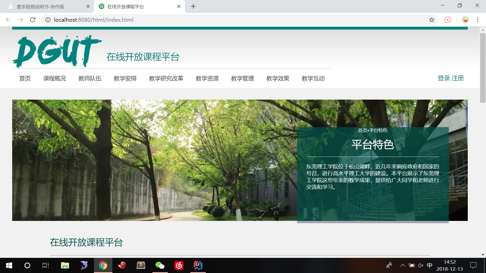{width="5.704305555555556in"
height="3.208672353455818in"}

> **首页**
>
> {width="5.704305555555556in"
> height="3.208672353455818in"}
>
> **课程概况**
>
> 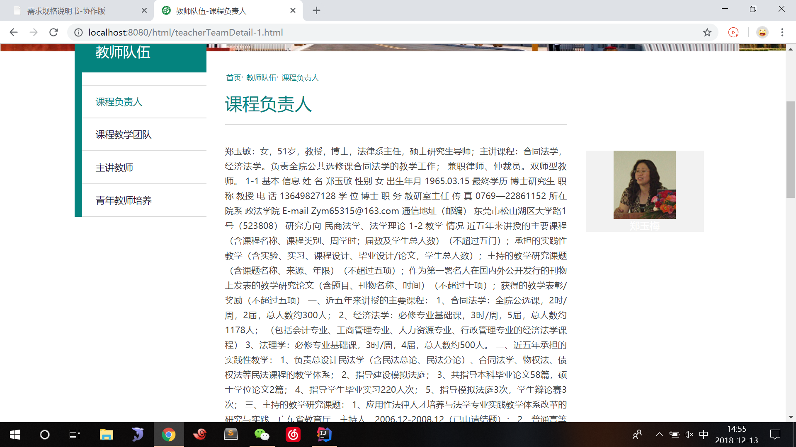{width="5.704305555555556in"
> height="3.208672353455818in"}
>
> **教师队伍**
>
> 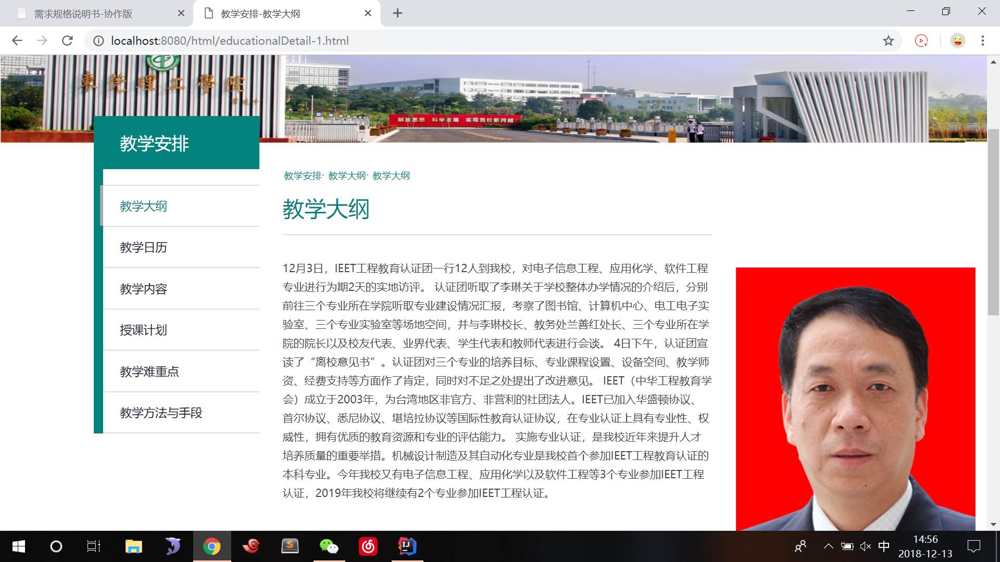{width="5.704305555555556in"
> height="3.208672353455818in"}
>
> **教学安排**
>
> 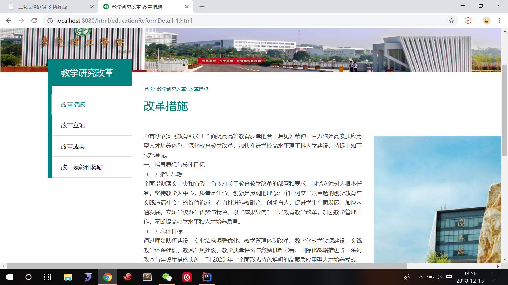{width="5.704305555555556in"
> height="3.208672353455818in"}
>
> **教学研究改革**
>
> 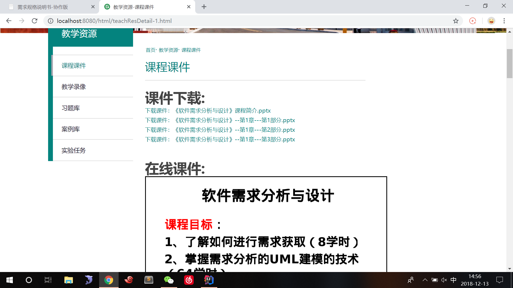{width="5.704305555555556in"
> height="3.208672353455818in"}
>
> **教学资源**
>
> 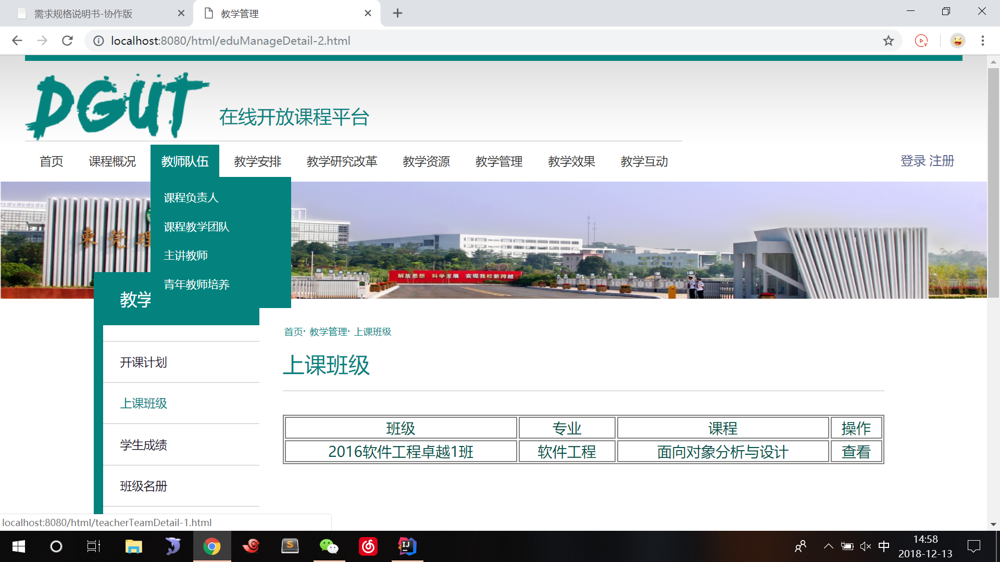{width="5.704305555555556in"
> height="3.208672353455818in"}
>
> **教学管理**
>
> 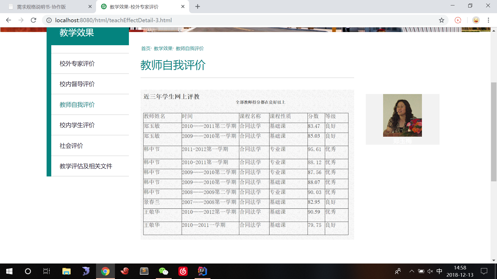{width="5.704305555555556in"
> height="3.208672353455818in"}
>
> **教学效果**
>
> 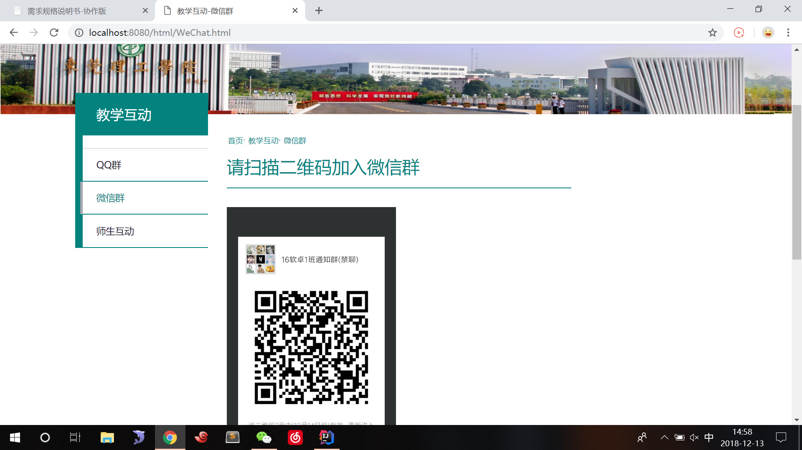{width="5.704305555555556in"
> height="3.208672353455818in"}
>
> **教学互动**

9.其他需求
===========

若有其他特殊的需求，请自己在本小节中补充。
