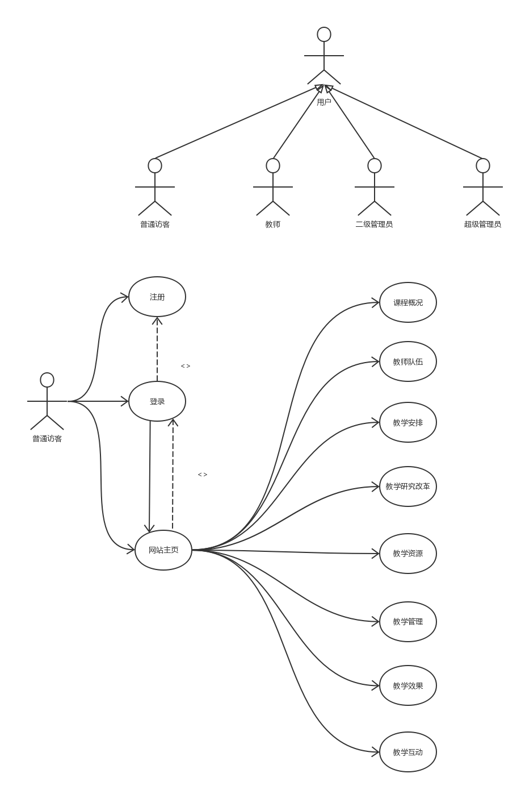
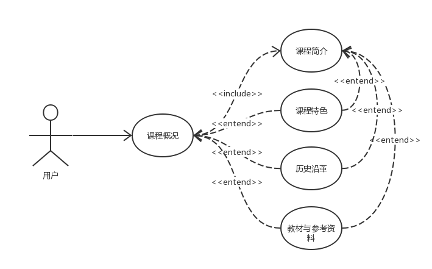
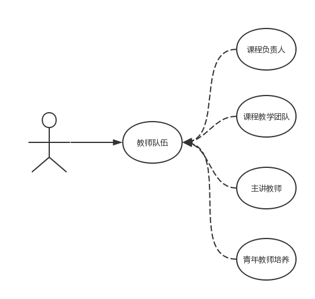
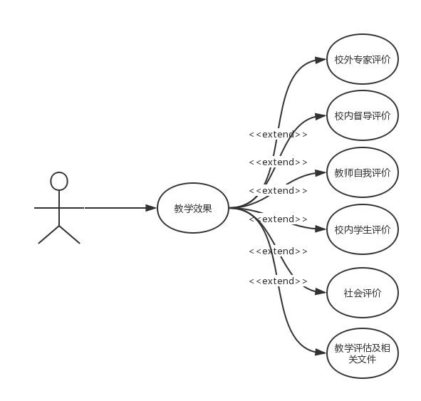
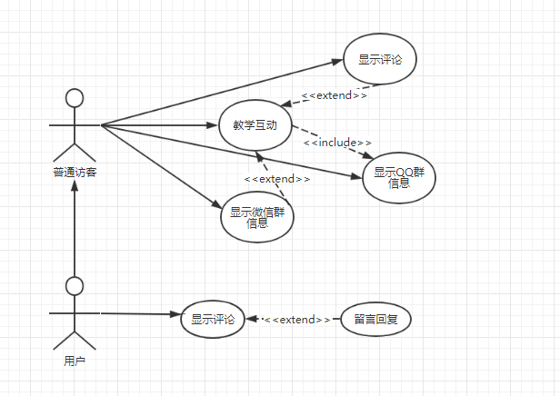

UML课程设计(前端)
=================

目录
----
-   [UML课程设计(前端)](#uml课程设计前端)
    -   [目录](#目录)
    -   [网站首页(贤政)](#网站首页贤政)
    -   [课程概况(和泽)](#课程概况和泽)
    -   [教师队伍(方勇)](#教师队伍方勇)
    -   [教学安排(乐祺, 文滔)](#教学安排乐祺-文滔)
    -   [教学研究改革(洪铭)](#教学研究改革洪铭)
    -   [教学资源(一起做)](#教学资源一起做)
    -   [教学管理(俊熙)](#教学管理俊熙)
    -   [教学效果(庭辉)](#教学效果庭辉)
    -   [教学互动(锦坚)](#教学互动锦坚)
    -   [登录及权限管理(公正)](#登录及权限管理公正)

网站首页(贤政)
--------------

### 功能描述

包括以下子功能：课程负责人，课程简介，课程特色，课程动态，教师团队（滚动展示），教学资源链接，友情链接。登录。

### 用例图

课程概况(和泽)
--------------

### 功能描述

包括以下子功能：课程简介，课程特色，教材与参考资料，历史沿革。

### 用例图

教师队伍(方勇)
--------------

### 功能描述

包括以下子功能：课程负责人，课程教学团队，主讲教师，青年教师培养。

### 用例图

### 用例描述

-   用例名称：查看课程负责人

> 参与者：普通访客\
> 用例描述：普通访客查看课程负责人\
> 活动图： 

-   用例名称：查看课程教学团队

> 参与者：普通访客\
> 用例描述：普通访客查看课程教学团队\
> 活动图： 

-   用例名称：查看主讲教师

> 参与者：普通访客\
> 用例描述：普通访客查看主讲教师\
> 活动图： 

-   用例名称：查看教材与参考资料

> 参与者：普通访客\
> 用例描述：普通访客查看教材与参考资料\
> 活动图： 

教学安排(乐祺, 文滔)
--------------------

### 功能描述

包括以下子功能：教学大纲，教学日历，教学内容，授课计划，教学难重点，教学方法与手段。

### 用例图

### 用例描述

-   用例名称：查看教学大纲

> 参与者：普通访客\
> 用例描述：普通访客查看教学大纲\
> 活动图： 

-   用例名称：查看教学内容

> 参与者：普通访客\
> 用例描述：普通访客查看教学内容\
> 活动图： 

-   用例名称：查看教学日历

> 参与者：普通访客\
> 用例描述：普通访客查看教学日历\
> 活动图： 

-   用例名称：查看授课计划

> 参与者：普通访客\
> 用例描述：普通访客查看授课计划\
> 活动图： 

-   用例名称：查看教学重难点

> 参与者：普通访客\
> 用例描述：普通访客查看教学重难点\
> 活动图： 

-   用例名称：查看教学方法与手段

> 参与者：普通访客\
> 用例描述：普通访客查看教学方法与手段\
> 活动图：
> 

-   用例名称：登陆

> 参与者：管理员\
> 用例描述：管理员登陆

-   用例名称：上传教学大纲

> 参与者：管理员\
> 用例描述：管理员上传教学大纲\
> 前置条件：登陆成功\
> 基本事件流：①管理员登陆 ②点击修改教学计划 ③上传教学大纲

-   用例名称：上传教学内容

> 参与者：管理员\
> 用例描述：管理员上传教学内容\
> 前置条件：登陆成功\
> 基本事件流：①管理员登陆 ②点击修改教学计划 ③上传教学内容

-   用例名称：上传教学日历

> 参与者：管理员\
> 用例描述：管理员上传教学日历\
> 前置条件：登陆成功\
> 基本事件流：①管理员登陆 ②点击修改教学计划 ③上传教学日历

-   用例名称：上传授课计划

> 参与者：管理员\
> 用例描述：管理员上传授课计划\
> 前置条件：登陆成功\
> 基本事件流：①管理员登陆 ②点击修改教学计划 ③上传授课计划

-   用例名称：上传教学重难点

> 参与者：管理员\
> 用例描述：管理员上传教学重难点\
> 前置条件：登陆成功\
> 基本事件流：①管理员登陆 ②点击修改教学计划 ③上传教学重难点

-   用例名称：上传教学方法与手段

> 参与者：管理员\
> 用例描述：管理员上传教学方法与手段\
> 前置条件：登陆成功\
> 基本事件流：①管理员登陆 ②点击修改教学计划 ③上传教学方法与手段

教学研究改革(洪铭)
------------------

### 功能描述

包括以下子功能：教学改革措施，教学改革立项，教学改革成果，教学表彰和奖励。

### 用例图

教学资源(一起做)
----------------

### 功能描述

包括以下子功能：课程课件（可以观看PPT、PDF、WORD），教学录像（可以播放视频），习题库（单选题、多选题、是非题、填空题、简答题、简单分析题、系统分析题、计算机水平考试题集），案例库（实验环境，实验系统代码，实验安装操作手册），实验任务，技术文档范本。

### 用例图

> 将自己画好的用例图粘贴在这里

教学管理(俊熙)
--------------

### 功能描述

包括以下子功能：开课计划，上课班级，班级花名册，班级成绩单，学生作业案例。

### 用例图

教学效果(庭辉)
--------------

### 功能描述

包括以下子功能：校外专家评价，校内督导评价，教师自我评价，校内学生评价，社会评价，教学评估及相关文件。

### 用例图

### 用例描述

-   用例名称：查看校外专家评价

> 参与者：普通访客\
> 用例描述：普通访客查看校外专家评价\
> 活动图： 

-   用例名称：查看校内监督评价

> 参与者：普通访客\
> 用例描述：普通访客查看校内监督评价\
> 活动图： 

-   用例名称：查看教师自我评价

> 参与者：普通访客\
> 用例描述：普通访客查看教师自我评价\
> 活动图： 

-   用例名称：查看校内学生评价

> 参与者：普通访客\
> 用例描述：普通访客查看校内学生评价\
> 活动图： 

-   用例名称：查看社会评价

> 参与者：普通访客\
> 用例描述：普通访客查看社会评价\
> 活动图： 

-   用例名称：查看教学评估及相关文件

> 参与者：普通访客\
> 用例描述：普通访客查看教学评估及相关文件\
> 活动图：
> 

教学互动(锦坚)
--------------

### 功能描述

包括以下子功能：微信群，QQ群，网站内的师生互动。

### 用例图

登录及权限管理(公正)
--------------------

### 功能描述

包括以下子功能:登录,注册,找回密码

### 用例图

